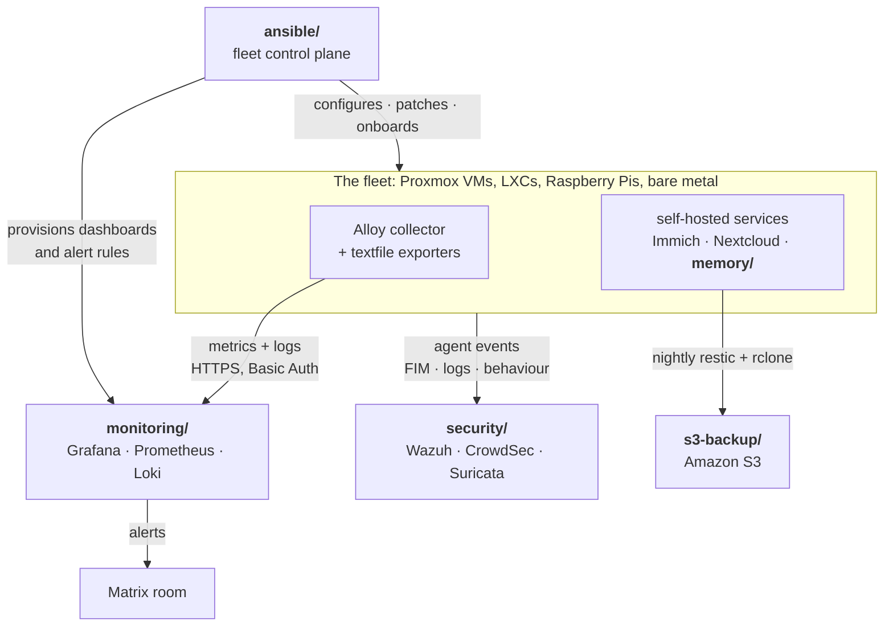

# homelab-infra

> Everything that keeps a self-hosted homelab running, as code: fleet
> automation, monitoring, off-site backup, and a semantic memory service for
> AI agents.

[](https://github.com/HarshitRuwali/homelab-infra/actions/workflows/deploy-docs.yml)
[](https://harshitruwali.github.io/homelab-infra/)
[](https://harshitruwali.github.io/homelab-infra/ansible/)
[](https://harshitruwali.github.io/homelab-infra/monitoring/)
[](https://www.proxmox.com/)

Six independent modules covering a Proxmox and Tailscale estate: Debian VMs,
LXC containers, Raspberry Pis and one bare-metal hypervisor. Every machine is
configured, patched and observed the same way, and every automated action
writes a metric, so **"it updates itself" can never quietly become "it broke
itself three weeks ago"**.

## Modules

| | Module | What it does | Docs |
|---|---|---|---|
| 🤖 | [**`ansible/`**](ansible/README.md) | Fleet control plane. Installs collectors, applies patches, updates containers, onboards hosts, provisions alerting. | [site](https://harshitruwali.github.io/homelab-infra/ansible/) |
| 📊 | [**`monitoring/`**](monitoring/README.md) | Central Grafana, Prometheus, Loki and Alloy. Dashboards, 47 alert rules, Matrix notifications. | [site](https://harshitruwali.github.io/homelab-infra/monitoring/) |
| 🧠 | [**`memory/`**](memory/README.md) | Self-hosted semantic memory for AI agents. PostgreSQL and Qdrant behind FastAPI, with an MCP server. | [site](https://harshitruwali.github.io/homelab-infra/memory/) |
| 💾 | [**`s3-backup/`**](s3-backup/README.md) | Nightly off-site backup of Immich and Nextcloud to Amazon S3, with restores drilled monthly. | [site](https://harshitruwali.github.io/homelab-infra/s3-backup/) |
| 🤖 | [**`aibox-model-queue/`**](aibox-model-queue/README.md) | Serializing proxy so one GPU's LM Studio host is shared without model-swap races. | [README](aibox-model-queue/README.md) |
| 🛡️ | [**`security/`**](security/README.md) | Wazuh, CrowdSec, Suricata, AdGuard Home, Authelia, OpenBao, ntopng and Greenbone across six small guests. Open source throughout, bar one flagged exception. | [site](https://harshitruwali.github.io/homelab-infra/security/) |

Each module stands alone. Nothing here requires you to run the others, and
every directory's README is a complete quick start by itself.

## How it fits together



`ansible/` puts software on machines and keeps it current. `monitoring/`
explains what the resulting telemetry means. That is the boundary between the
two, and it is why they are separate modules with separate docs.

## Quick start

Pick the module you need. Every command runs from the repository root.

<details>
<summary><b>🤖 Configure the fleet</b></summary>

```bash
cd ansible
cp inventory/hosts.example.yml inventory/hosts.local.yml   # then edit it
ansible-playbook playbooks/preflight.yml    # read-only, changes nothing
ansible-playbook playbooks/site.yml         # everything, idempotent
```

`site.yml` **configures** the machinery; it does not itself install packages or
pull images. Those apply on a schedule: 03:00 for packages, 04:00 for
containers. Nothing ever reboots a machine.

</details>

<details>
<summary><b>📊 Bring up the monitoring stack</b></summary>

```bash
cd monitoring
cp .env.example .env                        # set the two passwords and the domain
scripts/monitoring.sh central up            # Docker Compose
# or, for a native systemd LXC:
scripts/lxc-install.sh central
```

Ports bind to `127.0.0.1`. Put your own TLS reverse proxy in front, or use the
nginx config the LXC installer writes.

</details>

<details>
<summary><b>🧠 Run the memory service</b></summary>

```bash
cd memory
cp .env.example .env                        # then fill in POSTGRES_PASSWORD
mkdir -p memory-service/data/{qdrant,postgres,redis} api-service/logs
docker compose up -d --build
```

The API comes up on `http://localhost:8088`, with Swagger UI at `/docs`. It
needs an embedding model reachable at `AI_VM_HOST:EMBED_PORT`; without one,
`/health` is green but every write returns 502.

</details>

<details>
<summary><b>💾 Set up off-site backup</b></summary>

```bash
cd s3-backup
sudo ./install.sh --secrets aws             # on the server that has the HDD
```

Deploys to `/opt/s3-backup`, builds the pinned runner image, writes the config
by inspecting your running containers, and enables the timers. It then prints
the commands that finish the job.

</details>

> [!IMPORTANT]
> **Run Ansible from `ansible/`, never from here.** `ansible/ansible.cfg`
> resolves `inventory` and `roles_path` relative to the working directory, and
> Ansible reads a config file only from the directory it was invoked in. From
> the repository root it silently loads no inventory, no roles and no vault
> password, then fails in a way that looks like a permissions problem.

## Layout

```text
ansible/        Playbooks, roles, inventory. At the root, not under monitoring/,
                because patching and onboarding apply to every machine
monitoring/     Central stack, dashboards, alert rules, install scripts
memory/         api-service/, memory-service/, mcp-server/, ingestion scripts
s3-backup/      restic and rclone automation, installer, restore drills
aibox-model-queue/
                Serializing proxy for a shared LM Studio host
docs-landing/   The static index page of the published docs site
.github/        One workflow: it builds and publishes the docs, nothing else
```

## Documentation

Five MkDocs Material sites plus a landing page, on one GitHub Pages site:

| Path | Source |
|---|---|
| [`/`](https://harshitruwali.github.io/homelab-infra/) | `docs-landing/index.html` |
| [`/ansible/`](https://harshitruwali.github.io/homelab-infra/ansible/) | `ansible/mkdocs.yml` |
| [`/monitoring/`](https://harshitruwali.github.io/homelab-infra/monitoring/) | `monitoring/mkdocs.yml` |
| [`/memory/`](https://harshitruwali.github.io/homelab-infra/memory/) | `memory/mkdocs.yml` |
| [`/s3-backup/`](https://harshitruwali.github.io/homelab-infra/s3-backup/) | `s3-backup/mkdocs.yml` |
| [`/aibox-model-queue/`](https://harshitruwali.github.io/homelab-infra/aibox-model-queue/) | `aibox-model-queue/mkdocs.yml` |
| [`/security/`](https://harshitruwali.github.io/homelab-infra/security/) | `security/mkdocs.yml` |

```bash
cd ansible                                  # or monitoring, memory, s3-backup, aibox-model-queue, security
python3 -m venv .venv
.venv/bin/pip install -r docs/requirements.txt
.venv/bin/mkdocs serve                      # live preview on :8000
```

The five configs share the same Material theme and pinned dependencies, with
each site's name, URL and navigation tailored to its module. **Keep shared
theme and dependency changes aligned across all five.** Pull
requests build every site with `--strict`, which turns a broken link or a page
missing from the nav into a failure rather than a warning nobody reads.

Details, including the manual GitHub Pages step that cannot be automated, are
in [Building the docs](https://harshitruwali.github.io/homelab-infra/ansible/reference/tooling/).

## Secrets

Nothing in this repository holds a plaintext credential, and the docs pipeline
holds no repository secret either.

| What | Where it lives |
|---|---|
| Stack configuration | local `.env` files, gitignored |
| Ansible inventory | `ansible/inventory/hosts.local.yml`, **gitignored** |
| Ansible vault contents | `ansible/inventory/group_vars/all/vault.yml`, committed but **encrypted** |
| The vault password | `~/.config/ansible/monitorting-vault-pass`, outside this repository |
| Backup credentials | `/etc/s3-backup/` on the server, or AWS Secrets Manager |

The inventory is gitignored rather than merely tidy: this repository is public,
and an inventory is a complete map of the estate, including which box to hit to
blind the monitoring.

> [!CAUTION]
> **Two passwords are unrecoverable and live only outside this repository.**
> The Ansible vault password, without which `vault.yml` is lost, and the restic
> password, without which every S3 snapshot is permanently unreadable. Losing
> the AWS account loses that one *and* the backups together. Keep offline
> copies of both. See [Secrets](s3-backup/docs/secrets.md).

## History

| Directory | Origin repo |
|---|---|
| `memory/` | `HarshitRuwali/open-memory-stack` |
| `s3-backup/` | `HarshitRuwali/s3-backup-automation` |
| `monitoring/`, `ansible/` | `HarshitRuwali/monitorting-stack` |

All three repositories were merged in with `git subtree`, so every original
commit, author and date is preserved and the original SHAs still match the
archived upstreams. Commits from before the merge refer to paths as they were
in the standalone repos, so use `git log --follow <path>` to trace a file
across the boundary. `ansible/` was later promoted out of `monitoring/ansible/`
to the root, meaning its history crosses two path moves.
