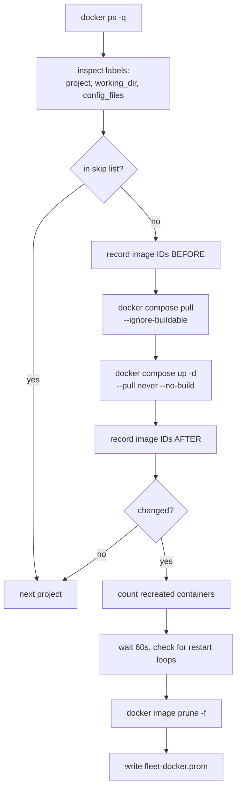

# Container updates

Pulls new images for every Docker Compose project on a host, recreates only
the containers whose image actually changed, then reclaims the layers that
fell out of use.

```bash
ansible-playbook playbooks/docker-updates.yml                        # configure, no pull
ansible-playbook playbooks/docker-updates.yml -e docker_update_run_now=true
```

Runs at **04:00 daily** with up to 30 minutes of jitter. See
[What runs when](schedules.md).

## Why Compose and not Watchtower

Watchtower recreates a container from the **running container's** config. That
config drifts from the compose file the moment anyone edits the compose file
without redeploying, and the drift is silent and unrecoverable: the compose
file stops being the source of truth.

`docker compose up -d` re-reads the file every time. The file stays
authoritative and this stays a *scheduler* rather than a second, competing
deployment mechanism.

## What makes this safe

!!! success "Your tag discipline, not the script"
    The script has no cleverness that prevents a destructive database
    upgrade. **Tag pinning in the compose files does.**

    `postgres:16-alpine` resolves only to 16.x, so a pull gets patch fixes and
    can never jump to 17 and refuse to start on a v16 data directory.

Current fleet, and what each tag actually permits:

| Container | Image | On a pull |
|---|---|---|
| `qdrant` | `qdrant/qdrant:v1.9.2` | no-op, fully pinned |
| `immich_postgres` | `ghcr.io/immich-app/postgres:14-vectorchord…` | no-op, fully pinned |
| `postgres`, `matrix-postgres` | `postgres:16-alpine` | patch within 16.x |
| `redis` | `redis:7.2-alpine` | patch within 7.2.x |
| `mysql` | `mysql:8.0` | patch within 8.0.x |
| `immich_redis` | `valkey/valkey:9` | minor+patch within 9.x |
| `immich_server`, `immich_machine_learning` | `…:v3` | minor+patch within v3 |
| `matrix-synapse` | `matrixdotorg/synapse:latest` | **anything** |
| `matrix-cloudflared` | `cloudflare/cloudflared:latest` | **anything** |
| `fastapi` | locally built, no registry | skipped, nothing to pull |

!!! danger "The corollary"
    If you ever retag a **stateful** service to `:latest` or to a bare major
    like `postgres`, this will happily perform a destructive major upgrade at
    04:00. Pin stateful services, or add the project to
    `docker_update_skip_projects`.

## Skipping a project

```yaml
# group_vars/<group>/main.yml or host_vars/<host>.yml
docker_update_skip_projects:
  - matrix
```

`matrix` is the obvious candidate: updating it restarts the Synapse homeserver
that the alert relay posts into, so a bad image there takes out your ability
to be told about it.

Prefer pinning the tag in the compose file where you can. A pin is a statement
about the service; a skip list is a statement about this scheduler.

## How it works



### Discovery is from running containers, not the filesystem

Scanning for compose files finds abandoned copies, half-finished experiments
and backups. The labels describe only what is **actually deployed right now**.

`config_files` is carried through because a project may not use the default
`docker-compose.yml` name, and `docker compose` in the wrong directory with
the wrong file silently creates a **second** stack rather than updating the
existing one.

### Pull failures stop that project's update

`--ignore-buildable` skips services with a local build definition. A registry
failure for any other service marks the run failed and prevents that project's
`up`. Authentication failures, missing tags and network errors are not treated
as successful updates. `up` uses `--pull never --no-build`, so it applies only
the images already fetched. A failed run retains old images by skipping pruning
and returns a nonzero exit status as well as setting
`fleet_docker_update_failed`.

!!! warning "No `--wait`, on purpose"
    Compose's `up --wait` treats **any** exited container as a failure, exit
    code 0 included, unless another service depends on it with
    `service_completed_successfully`. One-shot containers are normal (Greenbone
    ships seven that copy feed data and exit), so `--wait` turns a healthy
    project into a nightly failure. Readiness is checked after the health wait
    instead, across the host: any container restarting or unhealthy fails the
    run, including one this update did not touch.

The nonzero exit leaves `fleet-docker-update.service` in the `failed` state.
**Systemd Unit Failed** excludes that unit, because **Container Update Failed**
already pages for the same failure with more detail. One failure, one page.
On a workstation, no page: **Container Update Failed**
[skips workstations](#verification-after-the-run) on purpose, and without this
exclusion **Systemd Unit Failed** would page there instead.

Every Compose file recorded in the container labels must still be readable,
including overrides. A missing file stops the project before any pull or
redeployment; falling back to a base file could change ports and volume mounts.
The full configuration is reapplied, so editing it can recreate containers even
when their image IDs have not changed.

### Opting a host out

Move the host from `autoupdate` to `no_autoupdate` and run `site.yml` for that
host. The Docker play stops and disables existing updater units, removes their
files and deletes stale updater metrics. Hosts that remain monitored but are
removed from `autoupdate` are cleaned up too. Explicit `no_autoupdate` wins if a
host is accidentally in both groups. Keep a decommissioning host in inventory
until cleanup has run; Ansible cannot remove timers from a host it cannot target.
The opt-out play stops an active updater as well, so schedule the change outside
its update window to avoid interrupting a Compose operation.

### No `--remove-orphans`

That removes containers carrying the same project label whose services are
absent from the current Compose model. Preserve them for manual review.

### Change detection compares image IDs

`docker compose pull` reports "Pulled" even when every layer was already
local, so its output is not a reliable signal. Comparing the image IDs backing
the project's containers before and after is.

### Pruning is dangling-only

```bash
docker image prune -f     # yes: layers no longer referenced by any tag
docker image prune -a     # NO
```

!!! danger "Never `prune -a`"
    It deletes any image with no **running** container, which includes the
    image of anything deliberately stopped. That turns a routine cleanup into
    a multi-gigabyte re-download the next time you start it.

## Verification after the run

When any image changed, the script waits `docker_update_health_wait_seconds`
(60 by default) for containers to settle. Then, on every run, it checks the
whole host for unhealthy and restarting containers. That matters because a pull
that succeeds and an `up -d` that returns `0` can still leave a container
crash-looping on a new image, which is exactly the case worth alerting on.

!!! warning "A healthcheck that can never pass fails every run"
    The check is host-wide and runs even when nothing changed, so a container
    whose **healthcheck** is broken, not its service, fails the update every
    night. The qdrant image ships no `curl`, so a `curl` healthcheck on it reads
    `unhealthy` forever while the database serves normally, and
    `fleet-container-unhealthy` never fires because it was never healthy to
    begin with. Fix the check rather than skip the host: `memory/docker-compose.yml`
    has a curl-free one.

Metrics written to `fleet-docker.prom`:

| Metric | Meaning |
|---|---|
| `fleet_docker_update_last_run_timestamp_seconds` | when it last completed |
| `fleet_docker_update_failed` | 1 if anything went wrong |
| `fleet_docker_projects_updated` | projects whose images changed |
| `fleet_docker_containers_recreated` | containers moved to a new image |
| `fleet_docker_containers_restarting` | stuck restarting after the update |
| `fleet_docker_containers_unhealthy` | failing their healthcheck; any at all fails the run |
| `fleet_docker_image_bytes_reclaimed` | freed by pruning |

Two alerts consume them: `fleet-docker-update-failed` (critical) and
`fleet-docker-update-stale` (warning at 50 hours).

!!! note "`fleet-docker-update-failed` skips workstations"
    It excludes `role="workstation"`, today just `ubuntu-dev`. Both halves of
    that alert are noise on a dev box: half-built compose projects fail
    `up -d`, and a crashing container left `restarting` at 04:00 sets the same
    flag. The update still runs there and still writes every metric above, so
    the dashboards and `fleet-docker-update-stale` still cover it. If you need
    to know why a run failed on a workstation, read the journal:
    `journalctl -u fleet-docker-update.service -n 200`.

!!! info "Why 50 hours, not 25"
    The timer is daily with up to 30 minutes of jitter, and a host powered off
    for an evening should not page anyone.

## Systemd unit notes

The service runs as root with **no sandboxing directives**, deliberately.
`ProtectSystem` and `PrivateTmp` break `docker compose`, which must read
arbitrary compose files, `.env` files and bind-mount sources from wherever
they live. The security boundary here is the Docker socket, which is already
root-equivalent; sandboxing the client would be theatre.

There is no `[Install]` section on the service, so it does not run at boot.
The timer owns the schedule.

## Prerequisites

- **Docker Compose v2** (the CLI plugin), not `docker-compose` v1. The role
  fails loudly if it is missing, which beats failing at 04:00.
- Disk headroom for a new image set before the old one is pruned.
