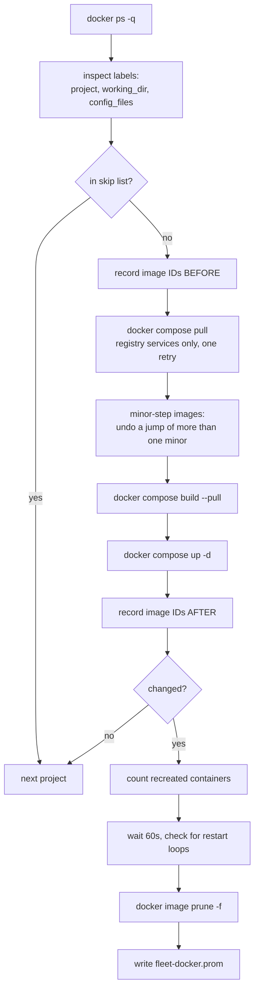

# Container updates

Pulls new registry images and rebuilds local images with fresh base images for
every Docker Compose project on a host. It applies changed images, checks for
restart loops, then reclaims layers that fell out of use.

```bash
ansible-playbook playbooks/docker-updates.yml                        # configure, no pull
ansible-playbook playbooks/docker-updates.yml -e docker_update_run_now=true
```

Runs at **04:00 daily** with up to 30 minutes of jitter. See
[What runs when](schedules.md).

## Why Compose and not Watchtower

Watchtower recreates a container from the **running container's** config. That
config drifts from the compose file the moment anyone edits the compose file
without redeploying, and the drift is silent and unrecoverable: the compose
file stops being the source of truth.

`docker compose up -d` re-reads the file every time. The file stays
authoritative and this stays a *scheduler* rather than a second, competing
deployment mechanism.

## What makes this safe

!!! success "Database majors are migrated separately"
    PostgreSQL and MySQL keep floating tags within their current major
    version. A pull gets current security and patch releases without asking a
    new database binary to start against an incompatible data directory.
    Moving to a newer database major requires a supervised data migration.

Current fleet, and what each tag actually permits:

| Container | Image | On a pull |
|---|---|---|
| `qdrant` | `qdrant/qdrant:latest` | latest stable; blocked if more than one minor ahead |
| `immich_postgres` | `ghcr.io/immich-app/postgres:14-vectorchord…` | rebuilt compatible tag, no fixed digest |
| `postgres`, `matrix-postgres` | `postgres:16-alpine` | patch within 16.x |
| `redis` | `redis:8-alpine` | latest stable 8.x |
| `mysql` | `mysql:8.0` | patch within 8.0.x |
| `immich_redis` | `valkey/valkey:9` | latest 9.x, no fixed digest |
| `immich_server`, `immich_machine_learning` | `…:release` | latest stable Immich release |
| `nextcloud-app-1`, `nextcloud-cron-1` | local build from `nextcloud:stable-apache` | rebuild against current stable base |
| `matrix-synapse` | `matrixdotorg/synapse:latest` | **anything** |
| `matrix-cloudflared` | `cloudflare/cloudflared:latest` | **anything** |
| `fastapi` | locally built, no registry | rebuilt if its compose file has `build:`, otherwise not pulled |

!!! danger "The corollary"
    Do not change PostgreSQL or MySQL to `:latest`: the updater cannot migrate
    their data directories. Qdrant is the exception because it is listed in
    `docker_update_minor_step_images`: the updater accepts a new image only if
    it is at most one minor ahead of the running one. Otherwise it points the
    tag back at the running image, updates the rest of the project and fails
    the run. Then step through the missed minors with
    `playbooks/upgrade-qdrant.yml -e qdrant_steps="v1.20.3 v1.21.1"`.

## Skipping a project

```yaml
# group_vars/<group>/main.yml or host_vars/<host>.yml
docker_update_skip_projects:
  - matrix
```

`matrix` is the obvious candidate: updating it restarts the Synapse homeserver
that the alert relay posts into, so a bad image there takes out your ability
to be told about it.

Prefer pinning the tag in the compose file where you can. A pin is a statement
about the service; a skip list is a statement about this scheduler.

## How it works



### Discovery is from running containers, not the filesystem

Scanning for compose files finds abandoned copies, half-finished experiments
and backups. The labels describe only what is **actually deployed right now**.

`config_files` is carried through because a project may not use the default
`docker-compose.yml` name, and `docker compose` in the wrong directory with
the wrong file silently creates a **second** stack rather than updating the
existing one.

### Local images are rebuilt

The pull covers only services a registry can provide. Services with a `build`
section are rebuilt by `docker compose build --pull` against fresh base
images, and an image that exists locally but never came from a registry (built
by hand and referenced only by `image:`) is left alone rather than requested
from Docker Hub.

A failed pull or build is retried once after
`docker_update_pull_retry_delay_seconds` (120 s), which absorbs Docker Hub rate
limits and short registry outages. A failure that survives the retry fails the
run and appears in the update alert.

### No `--remove-orphans`

That deletes containers this project did not create, which on a shared host
means deleting something a human started by hand.

### Change detection compares image IDs

`docker compose pull` reports "Pulled" even when every layer was already
local, so its output is not a reliable signal. Comparing the image IDs backing
the project's containers before and after is.

### Pruning is dangling-only

```bash
docker image prune -f     # yes: layers no longer referenced by any tag
docker image prune -a     # NO
```

!!! danger "Never `prune -a`"
    It deletes any image with no **running** container, which includes the
    image of anything deliberately stopped. That turns a routine cleanup into
    a multi-gigabyte re-download the next time you start it.

## Verification after the run

The script waits 60 seconds, then checks for containers stuck restarting. That
matters because a pull that succeeds and an `up -d` that returns `0` can still
leave a container crash-looping on a new image, which is exactly the case
worth alerting on.

Metrics written to `fleet-docker.prom`:

| Metric | Meaning |
|---|---|
| `fleet_docker_update_last_run_timestamp_seconds` | when it last completed |
| `fleet_docker_update_failed` | 1 if anything went wrong |
| `fleet_docker_projects_updated` | projects whose images changed |
| `fleet_docker_containers_recreated` | containers moved to a new image |
| `fleet_docker_containers_restarting` | stuck restarting after the update |
| `fleet_docker_image_bytes_reclaimed` | freed by pruning |

Two alerts consume them: `fleet-docker-update-failed` (critical) and
`fleet-docker-update-stale` (warning at 50 hours).

!!! note "`fleet-docker-update-failed` skips workstations"
    It excludes `role="workstation"`, today just `ubuntu-dev`. Both halves of
    that alert are noise on a dev box: half-built compose projects fail
    `up -d`, and a crashing container left `restarting` at 04:00 sets the same
    flag. The update still runs there and still writes every metric above, so
    the dashboards and `fleet-docker-update-stale` still cover it. If you need
    to know why a run failed on a workstation, read the journal:
    `journalctl -u fleet-docker-update.service -n 200`.

!!! info "Why 50 hours, not 25"
    The timer is daily with up to 30 minutes of jitter, and a host powered off
    for an evening should not page anyone.

## Systemd unit notes

The service runs as root with **no sandboxing directives**, deliberately.
`ProtectSystem` and `PrivateTmp` break `docker compose`, which must read
arbitrary compose files, `.env` files and bind-mount sources from wherever
they live. The security boundary here is the Docker socket, which is already
root-equivalent; sandboxing the client would be theatre.

There is no `[Install]` section on the service, so it does not run at boot.
The timer owns the schedule.

## Prerequisites

- **Docker Compose v2** (the CLI plugin), not `docker-compose` v1. The role
  fails loudly if it is missing, which beats failing at 04:00.
- Disk headroom for a new image set before the old one is pruned.
