# What runs when

Every automated action on the fleet, its cadence, and how to force it.

## The daily timeline

```mermaid
gantt
    dateFormat HH:mm
    axisFormat %H:%M
    title Nightly automation window
    section Packages
    unattended-upgrades (+0-60m jitter)  :a1, 03:00, 60m
    section Containers
    docker compose pull + up -d (+0-30m jitter) :a2, 04:00, 30m
    section Always
    update metrics (every 15m)  :done, 00:00, 1440m
```



| What | Unit | Schedule | Jitter | Reboots? |
|---|---|---|---|---|
| Package updates | `apt-daily-upgrade.timer` | `03:00` daily | up to +60 min | **never** |
| Container updates | `fleet-docker-update.timer` | `04:00` daily | up to +30 min | no, restarts containers |
| apt / reboot metrics | `fleet-update-metrics.timer` | every 15 min, and at boot | +5 min (+10 on Pis) | no |
| Alert evaluation | Grafana scheduler | every 1 min | none | no |

!!! info "Why containers wait an hour after packages"
    They must not overlap. A `docker-ce` or `containerd.io` upgrade from apt
    restarts the daemon and bounces every container on the host. If the
    container update is mid-`up -d` at that moment, it sees containers vanish
    underneath it and reports a spurious failure. An hour is comfortably more
    than the slowest observed apt run here.

!!! info "Why everything has jitter"
    Package updates: so a dozen hosts do not hit the same mirror at once, and
    so several SD-card Pis do not do heavy IO simultaneously.

    Container updates: Docker Hub rate-limits anonymous pulls **per source
    IP**, and every host here egresses through one address. Firing six hosts
    at exactly 04:00 gets you a `429` instead of an update.

## Metric freshness, and the reboot trap

The update-metrics exporter runs **every 15 minutes plus jitter**:

| Hosts | Effective interval |
|---|---|
| VMs and LXCs | 15 to 20 min |
| Pis (rpi5, rpi4b) | 15 to 25 min |

!!! bug "The confusing case this caused"
    `RandomizedDelaySec` applies to the timer's **boot** trigger as well as
    its calendar trigger. So after a reboot the refresh landed 3 to 13 minutes
    later on a Pi, during which `node_reboot_required` was still `1` from
    *before* the reboot. That reads as "I rebooted and it didn't clear", which
    is the single most confusing thing this exporter can do.

    Fixed by giving `fleet-update-metrics.service` its own
    `[Install] WantedBy=multi-user.target`, so a boot triggers it directly
    without the jitter. Safe because this fleet never auto-reboots: every boot
    is deliberate and one machine at a time, so there is no thundering herd to
    protect against.

`fleet-docker-update.service` deliberately has **no** `[Install]` section. It
pulls gigabytes and restarts services; a host coming back from maintenance
should not immediately re-download and bounce its whole stack.

## Forcing an update now

!!! danger "All of these restart things"
    Under `o=*`, maintainer scripts restart services as they go. A
    `docker-ce` bump bounces every container on the host. `tailscale` briefly
    drops the exit node and subnet routes. On the central node a Grafana or
    Loki upgrade puts a gap in the monitoring itself. Machines still never
    reboot.

=== "Packages"

    ```bash
    # one host first
    ansible ubuntu-dev -m shell -a 'unattended-upgrade -v' --become

    # then the rest
    ansible autoupdate -m shell -a 'unattended-upgrade -v' --become
    ```

    !!! warning "Exit 0 does not mean it did anything"
        `unattended-upgrade` has its own lock, separate from
        `/var/lib/dpkg/lock-frontend`. If another run holds it you get
        `Lock file is already taken, exiting` and **exit status 0**. Always
        check the pending count afterwards rather than trusting the return
        code.

=== "Containers"

    ```bash
    # supervised single host, asserts nothing was left restarting
    ansible-playbook playbooks/docker-updates.yml \
      --limit ubuntu-dev -e docker_update_run_now=true

    # or directly on the host
    ssh <host> 'sudo systemctl start fleet-docker-update.service'
    ```

=== "Metrics refresh"

    Cheap, safe, no restarts. Use this whenever a dashboard looks stale.

    ```bash
    ansible monitored -m systemd \
      -a 'name=fleet-update-metrics.service state=started' --become
    ```

## Arming and disarming

```bash
# check
ansible monitored -m shell -a 'systemctl is-enabled fleet-docker-update.timer' --become

# disarm container updates fleet-wide
ansible autoupdate -m systemd \
  -a 'name=fleet-docker-update.timer state=stopped enabled=false' --become

# re-arm
ansible autoupdate -m systemd \
  -a 'name=fleet-docker-update.timer state=started enabled=true' --become
```

Package patching is disarmed by moving a host from `autoupdate` to
`no_autoupdate` in the inventory and re-running the playbook. Hosts in
`no_autoupdate` still refresh their package **lists**, so `apt_upgrades_pending`
stays honest while nothing is installed.

## Seeing the next run

```bash
ansible monitored -m shell \
  -a 'systemctl list-timers fleet-docker-update.timer apt-daily-upgrade.timer fleet-update-metrics.timer --no-pager' \
  --become
```
