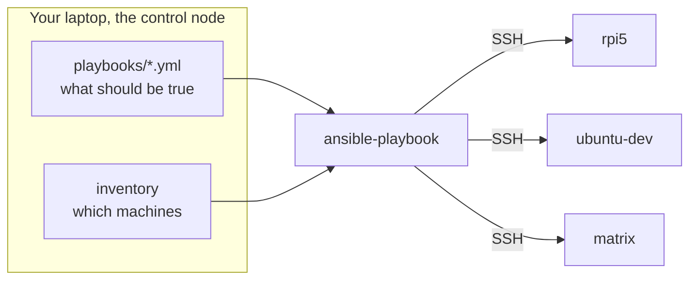

# Getting started

This section assumes **no prior Ansible experience**. If you have used Ansible
before, skip to [Fleet management](../fleet/index.md).

## What problem is being solved

There are about ten Linux machines here: VMs, LXC containers, a couple of
Raspberry Pis. Every one of them needs the same handful of things done to it:

- a monitoring agent installed and configured identically
- security updates applied on a schedule
- a script and a timer that report what needs patching

Doing that by hand ten times means ten chances to typo something, and no
record of what was done. Six months later nobody can answer "is this
configured the same as that one?"

Ansible answers that by putting the desired state in files. You describe what
a host should look like; Ansible connects over SSH and makes it so. Run it
again tomorrow and it changes nothing, because everything already matches.

## The mental model



Three things worth internalising immediately:

**Nothing is installed on the machines you manage.** No agent, no daemon.
Ansible is just SSH plus Python, both of which a Linux box already has. This
is why it is called *agentless*.

**Your laptop is the control node.** The machines it configures are *managed
nodes*. Ansible runs entirely from the control node and pushes outward.

**You describe the destination, not the journey.** You do not write "run
`apt install alloy`". You write "the package `alloy` should be present".
Ansible checks; if it is already there, it does nothing.

## Read these in order

<div class="grid cards" markdown>

- :material-numeric-1-circle: **[Ansible concepts](ansible-basics.md)**

    Inventory, playbooks, roles, tasks, modules, idempotency. Every term
    explained with an example from this repo.

- :material-numeric-2-circle: **[Your first run](first-run.md)**

    A read-only command, then a real one, with the actual output and what
    each line means.

- :material-numeric-3-circle: **[Reading the output](reading-output.md)**

    `ok`, `changed`, `skipping`, `failed`, and what `PLAY RECAP` is telling
    you.

- :material-numeric-4-circle: **[Glossary](glossary.md)**

    Every term in one place, including the non-Ansible ones.

</div>

## The single most important idea

**Idempotency.** A run that changes nothing is the normal, healthy outcome.

```text
PLAY RECAP ****************************************************
rpi5    : ok=18   changed=0   unreachable=0   failed=0
```

`changed=0` does not mean it did not work. It means the host already matched
the description, so there was nothing to do. Running the same playbook twenty
times in a row produces the same result as running it once.

This is what makes it safe to run these playbooks whenever you are unsure
about the state of something. You are not "re-installing"; you are asking
Ansible to confirm reality matches the files.

!!! tip "The corollary"
    A task that reports `changed` on **every** run is a bug, even if it works.
    It means you can no longer tell a real change from noise, and an Ansible
    run that is never green is one nobody reads. There is a real example of
    this being fixed in [Troubleshooting](../fleet/troubleshooting.md).

## What you will not have to learn

This repo is already written. You do not need to author roles to use it. In
practice you will:

- run `ansible-playbook playbooks/site.yml` and read the output
- occasionally edit a value in `group_vars/` or `hosts.local.yml`
- occasionally run one playbook against one host with `--limit`

The concepts page covers the rest so the files make sense when you open them.
