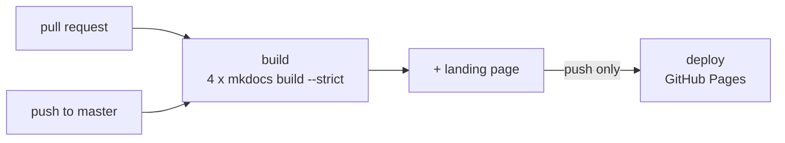

# Building the docs

These pages are a MkDocs site. Building it needs Python, and publishing it is
one workflow, shared by every stack in this repository.

## Locally

```bash
cd ansible                          # from the repository root
python3 -m venv .venv
.venv/bin/pip install -r docs/requirements.txt

.venv/bin/mkdocs serve            # preview on http://127.0.0.1:8000
.venv/bin/mkdocs build            # render into site/
.venv/bin/mkdocs build --strict   # what the pipeline runs
```

!!! tip "`cd` into the stack first, or pass `-f`"
    There are four `mkdocs.yml` files in this repository, and `mkdocs` looks
    for one in the working directory. From the repository root, build this
    site with `mkdocs build -f ansible/mkdocs.yml` instead.

!!! tip "Use `--strict` before pushing"
    It promotes broken internal links and pages missing from the nav into
    build failures instead of warnings you scroll past. The workflow uses it,
    so a non-strict build passing locally is not a guarantee.

### Dependencies

Pinned in `docs/requirements.txt` so a laptop and the CI runner render
identically:

```text
mkdocs==1.6.1
mkdocs-material==9.7.7
pymdown-extensions==11.0.1
markdown==3.10.3
```

!!! warning "All four requirements files must stay identical"
    The workflow installs every stack's file into **one** environment, so a
    version that differs between them is a resolver conflict in CI rather than
    a local inconvenience. Change one, change all four.

!!! warning "MkDocs is pinned to 1.x deliberately"
    MkDocs 2.0 removes the plugin system and rewrites theming with no
    migration path, which breaks mkdocs-material outright. Do not loosen
    `mkdocs==1.6.1` without rebuilding and checking the nav.

!!! bug "`uvx --with mkdocs-material` resolves unpinned"
    It is a fine way to take a quick look, but it can pull a pairing this
    repository has already been burned by. On pymdown-extensions 10.14 the
    superfences parser silently failed on any fence without an attribute list,
    so a ` ```yaml ` block became an inline code span and rendered as an
    unformatted paragraph. Only fences carrying `title="..."` survived, which
    is why the breakage looked random. Use the pinned venv for anything you
    intend to publish.

`site/` and `.venv/` are both gitignored.

## The other sites in this repository

One GitHub Pages site, five paths. **Every module has its own dedicated site**;
none is folded into another:

| Path | Built from | Covers |
|---|---|---|
| `/homelab-infra/` | `docs-landing/index.html`, a plain static file | the index |
| `/homelab-infra/monitoring/` | `monitoring/mkdocs.yml` | the central Grafana, Prometheus, Loki and Alloy stack |
| `/homelab-infra/ansible/` | `ansible/mkdocs.yml` | the fleet control plane: playbooks, roles, inventory |
| `/homelab-infra/memory/` | `memory/mkdocs.yml` | the semantic memory service and MCP server |
| `/homelab-infra/s3-backup/` | `s3-backup/mkdocs.yml` | off-site backup and restore |

!!! info "The four configs are deliberately near-identical"
    They differ only in `site_name`, `site_description`, `site_url`, `edit_uri`
    and `nav`. The theme, palette, feature flags and markdown extensions match
    exactly, and `docs/stylesheets/extra.css` and `docs/requirements.txt` are
    byte-identical copies. These are separate builds served under one domain,
    so a reader crossing between them should not notice a seam. **If you change
    theme, palette, extensions or pins in one, change all four.**

!!! warning "Links between sites must be absolute"
    Each site is its own MkDocs build and knows nothing of the others, so a
    relative path into a sibling site is a broken link that `--strict` will
    reject. Link across with the full published URL, for example
    `https://harshitruwali.github.io/homelab-infra/ansible/fleet/setup/`.

## Publishing

The repository-root `.github/workflows/deploy-docs.yml` publishes to GitHub
Pages. It is the only workflow here.



Pull requests run the **same** build but stop before publishing, so a broken
link is caught before it reaches `master` rather than after it is already live.
All four sites build on every run: a change to this stack's docs still rebuilds
the other three, which is what keeps a shared stylesheet honest.

### Triggers

Only `docs/**` or `mkdocs.yml` under one of the four stacks, `docs-landing/`,
or the workflow itself. Editing a playbook, a dashboard or application code
does not republish. `workflow_dispatch` republishes by hand from the Actions
tab without an empty commit.

Concurrency is `cancel-in-progress: false` on purpose: a half-finished Pages
deploy leaves the published site broken, so an in-flight deploy completes.

### What it cannot do

```yaml
permissions:
  contents: read     # checkout
  pages: write       # upload the artifact
  id-token: write    # claim the deployment
```

No `contents: write`, no repository secrets, no `ansible-playbook`, no SSH.
The workflow cannot push to the repository, cannot reach any host in the fleet,
and cannot touch a datastore. It turns Markdown into HTML and uploads it.

### Enabling Pages: a required manual step

**Settings** → **Pages** → **Source: GitHub Actions**

Do this once, before the first push. The site then appears at
`https://harshitruwali.github.io/homelab-infra/ansible/`.

!!! bug "There is no way to automate it, and the errors do not say so"
    The first run failed here. `GET /repos/<owner>/<repo>/pages` returned
    **404**: Pages had simply never been enabled, and no message mentioned it.

    The obvious fix, `actions/configure-pages` with `enablement: true`, does
    not work either:

    ```text
    Warning: Get Pages site failed. Error: Not Found
    Error: Create Pages site failed.
           Error: Resource not accessible by integration
    ```

    Creating a Pages site is an **admin-level** API call, and `GITHUB_TOKEN`
    does not have admin rights regardless of the `pages: write` permission. So
    `configure-pages@v5` is used **without** `enablement`: it reads the
    configuration, and the configuration has to already exist. Only a personal
    access token would do it, and this workflow deliberately uses no secret.

Until Pages is enabled, the **build** job fails, at the `Configure GitHub Pages`
step, after every `mkdocs build --strict` has already passed. That step is
skipped on pull requests precisely so a docs-only PR does not go red for a
repository setting it cannot change.

!!! warning "`site_url` must match where it is served"
    `mkdocs.yml` sets `site_url` to the Pages project path. GitHub serves a
    project repo under `/<repo>/`, and this site lives in a subdirectory of
    that, so the trailing path matters: without it every canonical URL and
    every `sitemap.xml` entry points at the domain root. Change it if you move
    the site behind your own domain.

## Before you push

The workflow builds with `--strict`, but that does not check everything. Two
things are worth a glance by hand, because this repository is **public** and
the published site is public with it.

**Heading anchors.** `--strict` validates page-to-page links but not the
`#anchor` part, so a link to a renamed heading builds clean and 404s in the
browser.

**Site-specific data.** The docs are the easiest place for a real address to
end up, because examples get pasted from a working terminal. Everything here
should use `example.com`, RFC 5737 addresses (`192.0.2.0/24`), or the
documented Tailscale placeholders `100.64.0.11` and `.12`.

```bash
grep -rnE '10\.10\.[0-9]+\.[0-9]+|100\.(6[4-9]|[7-9][0-9]|1[0-2][0-9])\.' docs/
```

## Serving it yourself instead

`mkdocs build` renders a self-contained static site into `site/`. Serve it from
an nginx location, or `python3 -m http.server` for a quick look.

Nothing about these docs depends on GitHub. If any of this should not be
public, serve `site/` behind your existing auth and delete the workflow.
