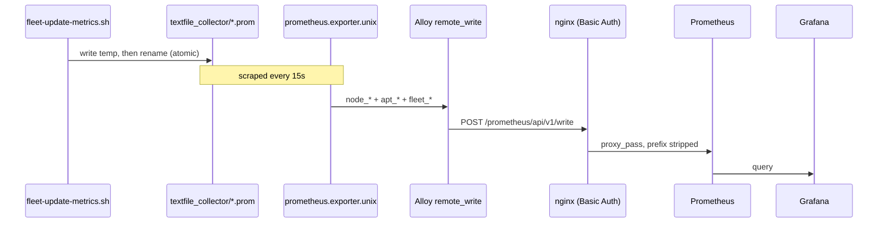
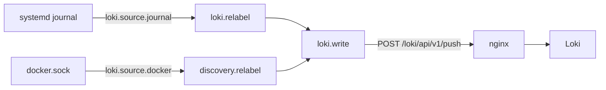

# Data flow

What each component emits, and how it reaches a dashboard.

## Metrics



Three exporters feed the same remote-write pipeline:

| Component | Job label | Emits |
|---|---|---|
| `prometheus.exporter.unix` | `integrations/unix` | `node_*`, plus anything in the textfile directory |
| `prometheus.exporter.cadvisor` | `integrations/cadvisor` | `container_*` |
| Alloy self-scrape | `alloy` | `prometheus_remote_storage_*`, component health |

External labels `host` and `role` are attached by Alloy from
`MONITOR_HOSTNAME` and `MONITOR_ROLE` in `/etc/default/alloy`.

!!! danger "Never rename `MONITOR_HOSTNAME`"
    Every `host=` label keys off it. Renaming forks the host's history in
    Prometheus: old series keep the old label forever and nothing joins them.
    `monitor-lxc` pins its value in `host_vars/` for exactly this reason.

## The textfile bridge

Anything a shell script can compute becomes a Prometheus metric by writing a
`.prom` file into `/var/lib/node_exporter/textfile_collector/`.

```alloy
prometheus.exporter.unix "host" {
  textfile {
    directory = "/var/lib/node_exporter/textfile_collector"
  }
}
```

Two producers write there:

| File | Written by | Cadence |
|---|---|---|
| `fleet-updates.prom` | `fleet-update-metrics.sh` | every 15 min + at boot |
| `fleet-docker.prom` | `fleet-docker-update.sh` | after each container update |

!!! warning "Always write-then-rename"
    The collector will happily read a half-written file and export garbage.
    Both scripts write to a temp file in the same directory and `mv` it into
    place, because rename is atomic within a filesystem.

Free bonus: node_exporter emits `node_textfile_mtime_seconds` automatically,
so a script that dies silently is still centrally detectable.

## Logs



Label sets applied:

| Source | Labels |
|---|---|
| journal | `job="systemd-journal"`, `source="journal"`, `unit`, `level`, `host`, `role` |
| docker | `job="docker"`, `source="docker"`, `container`, `container_id`, `compose_service`, `host`, `role` |

`source` is what makes "journal vs container logs" a cheap query rather than a
regex over stream names.

!!! tip "The free audit trail"
    `Unattended-Upgrade::SyslogEnable "true"` puts every package action into
    the journal, which Alloy already ships. That gives a central, queryable
    record of every package applied on every host with no extra plumbing:

    ```logql
    {unit="unattended-upgrades.service"} |= "Packages that will be upgraded"
    ```

## Ingest path asymmetry

The nginx paths do **not** behave the same way, and getting this wrong
produces confusing 404s:

| Public path | Upstream receives | Note |
|---|---|---|
| `/prometheus/api/v1/write` | `/api/v1/write` | prefix **stripped** |
| `/loki/api/v1/push` | `/loki/api/v1/push` | prefix **preserved** |

So a Loki query URL is `/loki/api/v1/label/host/values`, not
`/loki/loki/api/v1/...`. Readiness probes follow the same rule:
`/prometheus/-/ready` and `/loki/ready`.

## Backpressure

Onboarding a fleet at once means backfilling a lot of journal history through
one ingest path. Three things keep that from failing:

```alloy
queue_config {
  capacity            = 10000
  max_shards          = 10
  batch_send_deadline = "5s"
  retry_on_http_429   = true   // retry rather than drop
}
```

- `retry_on_http_429 = true` on the collector side.
- Raised `ingestion_rate_mb` in `loki/loki-config.yml` on the server side.
- `alloy_journal_max_age` lowered to `1h` on hosts with enormous journals.

Without all three, starting `loki.source.journal` with a 12h `max_age` on
several hosts simultaneously **will** hit Loki's default 4 MB/s limit.
