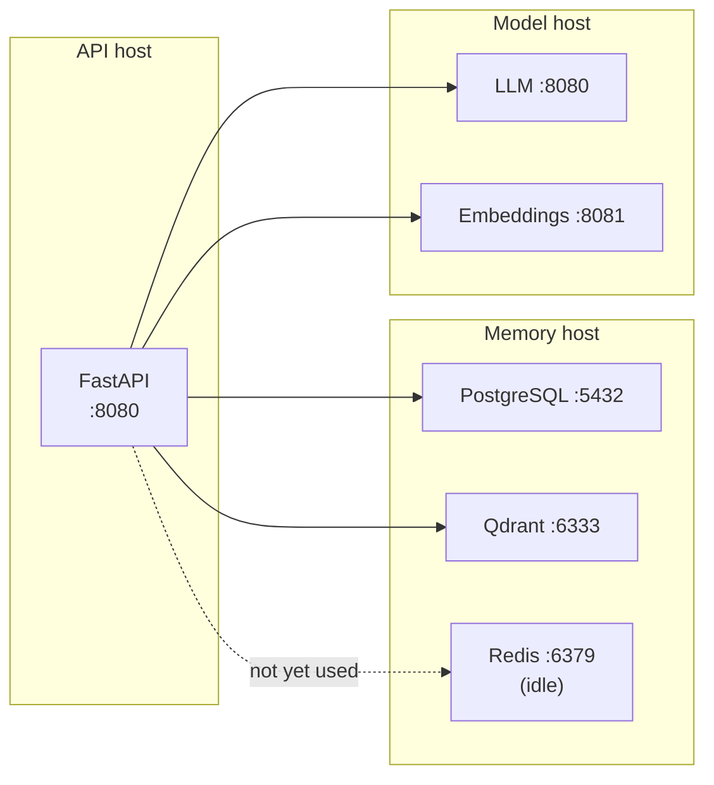

# Split deployment

Two Compose files exist so the datastores and the API can live on different
hosts: `memory-service/docker-compose.yml` runs PostgreSQL, Qdrant and Redis;
`api-service/docker-compose.yml` runs the API alone.

This is the shape to use when the memory services sit on a storage host and the
API sits next to your GPU box, or when several API instances share one
collection.



!!! note "Redis is provisioned but idle"
    No code path connects to it. `REDIS_HOST` still has to be set — the settings
    model requires it — but the value is never dialled.

## Start the memory services

```bash
cd memory-service
cp .env.example .env
# Fill in POSTGRES_PASSWORD.
mkdir -p data/qdrant data/postgres data/redis
docker compose up -d
docker compose logs -f
```

These containers publish their ports on the host, so anything that can reach
the host can reach PostgreSQL and Qdrant. Neither speaks TLS and Qdrant has no
authentication configured here.

!!! danger "Do not expose the memory host beyond a trusted network"
    PostgreSQL is password-protected; **Qdrant is not**. Anyone who can reach
    `:6333` can read every stored chunk and delete the collection. Keep this
    host on a private VLAN, a WireGuard/Tailscale network, or behind a firewall
    that only admits the API host.

## Start the API

```bash
cd api-service
cp .env.example .env
```

Set the four host variables to point at the other machines:

```bash
POSTGRES_HOST=<memory host>
QDRANT_HOST=<memory host>
REDIS_HOST=<memory host>
AI_VM_HOST=<model host>
```

```bash
docker compose up -d --build
docker compose logs -f
```

The split Compose file uses `env_file: .env`, so every variable comes from that
one file — unlike the root Compose file, which passes them explicitly.
`FASTAPI_PORT` defaults to `8080` here, since nothing else is competing for it
on a dedicated API host.

## The two `.env` files are not interchangeable

| File | Configures | Datastores |
|---|---|---|
| `.env` | the all-in-one root Compose stack | its own local containers |
| `api-service/.env` | the API alone | pre-existing, on another host |

!!! danger "`VECTOR_DIM` is the trap"
    Copying the root `.env` over `api-service/.env` points a fresh-collection
    configuration at a live collection. If the dimensions disagree the service
    now refuses to start, which is the good outcome — but if they happen to
    agree you have silently repointed the API at the wrong datastores. Treat
    the two files as unrelated. See
    [Vector dimensions](../operations/vector-dimensions.md).

## Migrations on a split deployment

The API container still runs `alembic upgrade head` on start, against whatever
`POSTGRES_HOST` names. Only one API instance should come up first against a
fresh database — concurrent Alembic runs on the same database race. Start one,
let it migrate, then scale out. See [Migrations](../operations/migrations.md).
