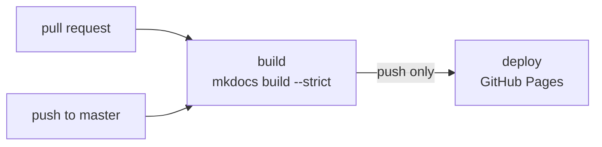

# Building the docs

These pages are a MkDocs site. Building it needs Python, and publishing it is
one workflow.

## Locally

```bash
python3 -m venv .venv
.venv/bin/pip install -r docs/requirements.txt

.venv/bin/mkdocs serve            # preview on http://127.0.0.1:8000
.venv/bin/mkdocs build            # render into site/
.venv/bin/mkdocs build --strict   # what the pipeline runs
```

!!! tip "Use `--strict` before pushing"
    It promotes broken internal links and pages missing from the nav into
    build failures instead of warnings you scroll past. The workflow uses it,
    so a non-strict build passing locally is not a guarantee.

### Dependencies

Pinned in `docs/requirements.txt` so a laptop and the CI runner render
identically:

```text
mkdocs==1.6.1
mkdocs-material==9.5.49
pymdown-extensions==10.14
```

!!! warning "MkDocs is pinned to 1.x deliberately"
    MkDocs 2.0 removes the plugin system and rewrites theming with no
    migration path, which breaks mkdocs-material outright. Do not loosen
    `mkdocs==1.6.1` without rebuilding and checking the nav.

`site/` and `.venv/` are both gitignored.

## Publishing

`.github/workflows/deploy-docs.yml` publishes to GitHub Pages. It is the only
workflow in this repository.



Pull requests run the **same** build but stop before publishing, so a broken
link is caught before it reaches `master` rather than after it is already
live.

### Triggers

Only `docs/**`, `mkdocs.yml`, or the workflow itself. Editing a playbook or a
dashboard does not republish. `workflow_dispatch` republishes by hand from the
Actions tab without an empty commit.

Concurrency is `cancel-in-progress: false` on purpose: a half-finished Pages
deploy leaves the published site broken, so an in-flight deploy completes.

### What it cannot do

```yaml
permissions:
  contents: read     # checkout
  pages: write       # upload the artifact
  id-token: write    # claim the deployment
```

No `contents: write`, no repository secrets, no `ansible-playbook`, no SSH.
The workflow cannot push to the repository and cannot reach any host in the
fleet.

### Enabling Pages: a required manual step

**Settings** → **Pages** → **Source: GitHub Actions**

Do this once, before the first push. The site then appears at
`https://<user>.github.io/<repo>/`.

!!! bug "There is no way to automate it, and the errors do not say so"
    The first run failed here. The build passed, then `deploy-pages` failed
    with a message that never mentions Pages being off.
    `GET /repos/<owner>/<repo>/pages` returned **404**: Pages had simply never
    been enabled.

    The obvious fix, `actions/configure-pages` with `enablement: true`, does
    not work either:

    ```text
    Warning: Get Pages site failed. Error: Not Found
    Error: Create Pages site failed.
           Error: Resource not accessible by integration
    ```

    Creating a Pages site is an **admin-level** API call, and `GITHUB_TOKEN`
    does not have admin rights regardless of the `pages: write` permission.
    So `configure-pages@v5` is used **without** `enablement`: it reads the
    configuration, and the configuration has to already exist.

Until Pages is enabled, `build` passes and `deploy` fails.

!!! warning "`site_url` must match where it is served"
    `mkdocs.yml` sets `site_url` to the Pages project path. GitHub serves a
    project repo under `/<repo>/`, and without the trailing path every
    canonical URL and every `sitemap.xml` entry points at the domain root.
    Change it if you move the site behind your own domain.

## Before you push

The workflow builds with `--strict` but does not check everything. Two things
are worth a glance by hand, because this repository is **public** and the
published site is public with it.

**Heading anchors.** `--strict` validates page-to-page links but not the
`#anchor` part, so a link to a renamed heading builds clean and 404s in the
browser.

**Site-specific data.** The docs are the easiest place for a real address to
end up, because examples get pasted from a working terminal. Everything here
should use `example.com`, RFC 5737 addresses (`192.0.2.0/24`), or the
documented Tailscale placeholders `100.64.0.11` and `.12`.

```bash
grep -rnE '10\.10\.[0-9]+\.[0-9]+|100\.(6[4-9]|[7-9][0-9]|1[0-2][0-9])\.' docs/
```

## Serving it yourself instead

`mkdocs build` renders a self-contained static site into `site/`. Serve it
from an nginx location on the central LXC, or `python3 -m http.server` for a
quick look.

Nothing about the docs depends on GitHub. If any of this should not be public,
serve `site/` behind your existing auth and delete the workflow.
