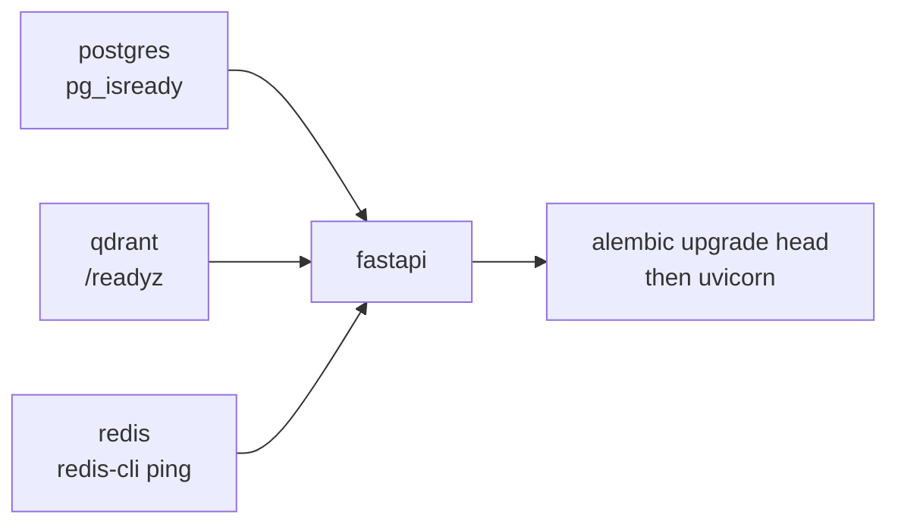

# One machine

The root `docker-compose.yml` runs PostgreSQL, Qdrant, Redis and the FastAPI
service together, with the datastores bind-mounted under `memory-service/data/`.

## Bring it up

```bash
cp .env.example .env
```

Fill in `POSTGRES_PASSWORD`. If your LLM and embedding services run somewhere
other than the Docker host, change `AI_VM_HOST` too.

```bash
mkdir -p memory-service/data/qdrant memory-service/data/postgres memory-service/data/redis api-service/logs
docker compose up -d --build
docker compose logs -f
```

The bind-mount directories have to exist first. Docker would otherwise create
them as `root`, and PostgreSQL refuses to initialise into a directory it cannot
own.

## Check it

```bash
curl http://localhost:8088/health
```

```json
{
  "status": "ok",
  "postgres": "ok",
  "qdrant": "ok",
  "qdrant_collection": "memory",
  "configured_vector_dim": 1024,
  "collection_vector_dim": 1024
}
```

Interactive API docs are at `http://localhost:8088/docs`.

!!! warning "`status: ok` does not mean embeddings work"
    `/health` probes PostgreSQL and Qdrant only. The embedding service is not
    checked, so a green health check with a dead embed model still fails every
    write with **502**. [Your first memory](first-memory.md) is the real test.

## Ports

`FASTAPI_PORT` sets the host port; the container listens on `APP_PORT` (8080)
regardless.

```text
FASTAPI_PORT=8088   # http://localhost:8088 → container :8080
```

The default is deliberately not 8080: that port is usually already taken by the
LLM service on the same machine.

## Data persistence

Everything stateful is a bind mount, not a named volume:

| Path | Contents |
|---|---|
| `memory-service/data/postgres` | chunk metadata, file tracking, entities |
| `memory-service/data/qdrant` | vectors, payload indexes, snapshots |
| `memory-service/data/redis` | AOF and RDB state |

Because these are bind mounts, **`docker compose down -v` does not delete your
memories**. That is the point: `-v` reaps anonymous volumes, and there are
none. To actually wipe state, stop the stack and delete the directories.

```bash
docker compose down
rm -rf memory-service/data/qdrant memory-service/data/postgres memory-service/data/redis
```

See [Backups](../operations/backups.md) before you do that on anything you care
about.

## Startup order

Compose waits on health checks rather than start order:



!!! warning "The qdrant check cannot use curl"
    The qdrant image ships no `curl` or `wget`, so a `curl` healthcheck fails
    forever while qdrant serves normally, and Compose then refuses to start
    `fastapi` at all. The check in `docker-compose.yml` has bash send the HTTP
    request itself over `/dev/tcp`.

The FastAPI container runs `alembic upgrade head` before starting Uvicorn, so a
fresh database is migrated on first boot with no manual step. See
[Migrations](../operations/migrations.md).

## Reaching services on the host

`AI_VM_HOST=host.docker.internal` resolves to the Docker host, which the root
Compose file wires up explicitly:

```yaml
extra_hosts:
  - "host.docker.internal:host-gateway"
```

Without that line the name does not resolve on Linux. Point `AI_VM_HOST` at an
IP or DNS name instead when the models run on another machine.
