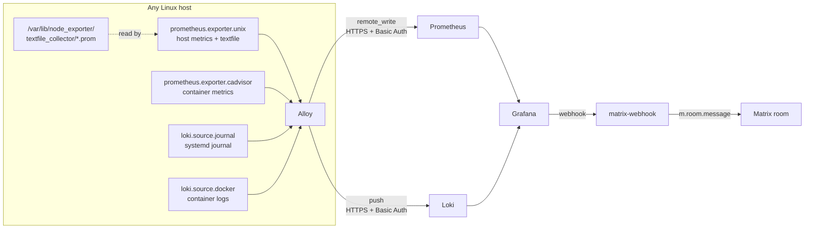

# Architecture

One central stack, one reusable collector, and a push relationship between
them.

## Central stack

The central node runs four services. It exists in two deployment shapes that
must not be confused:

=== "Direct LXC (this fleet)"

    Installed by `scripts/lxc-install.sh central`. Native systemd services,
    with nginx terminating Basic Auth in front of the ingest paths. This is
    what is actually deployed.

    | Service | Bind | Purpose |
    |---|---|---|
    | Grafana | `127.0.0.1:3000` | dashboards, unified alerting |
    | Prometheus | `127.0.0.1:9090` | metrics, remote-write receiver |
    | Loki | `127.0.0.1:3100` | logs |
    | Alloy | `127.0.0.1:12345` | the central node's own telemetry |
    | nginx | `:80` | reverse proxy and Basic Auth |
    | matrix-webhook | `127.0.0.1:4785` | Grafana to Matrix relay |

=== "Docker Compose (generic)"

    `docker-compose.yml` runs Grafana, Prometheus, Loki and Alloy as
    containers with external volumes. Useful for a fresh deployment
    elsewhere; not what this fleet runs.

!!! tip "Telling them apart"
    Both `/prometheus/-/ready` and `/loki/ready` returning `401` means the
    direct-LXC path, because only `lxc-install.sh` writes those `auth_basic`
    blocks.

## Collector flow



Every host uses the same ingest base URL from the inventory. Sites where all
collectors can reach central nginx privately can set `monitoring_ingest_base_url`
in `hosts.local.yml` to avoid sending internal telemetry through the public
tunnel. Other sites use the public HTTPS monitoring domain.

### Private ingest

The private URL should be HTTPS, or the Basic Auth credential and all
telemetry cross the LAN in cleartext. Central nginx serves the two ingest
paths on port 443 when `/etc/nginx/tls/monitoring-ingest.{crt,key}` exist
(`scripts/lxc-install.sh` adds the listener); port 80 stays for the Cloudflare
tunnel, which connects over loopback. Sign the certificate with your own CA and
list every private address collectors use:

```bash
cd ~/Documents/homelab-ca   # wherever the CA lives; ca.key never leaves it
cat > monitor-ingest.ext <<'EXT'
subjectAltName=DNS:monitor-lxc,IP:10.0.0.10
basicConstraints=critical,CA:FALSE
keyUsage=critical,digitalSignature,keyEncipherment
extendedKeyUsage=serverAuth
EXT
openssl req -new -newkey rsa:2048 -nodes -keyout monitor-ingest.key \
  -subj "/CN=monitor-lxc" -out monitor-ingest.csr
openssl x509 -req -in monitor-ingest.csr -CA ca.crt -CAkey ca.key \
  -CAserial ca.srl -days 825 -sha256 -extfile monitor-ingest.ext \
  -out monitor-ingest.crt
```

Copy the certificate and key to `/etc/nginx/tls/` on the central box (key mode
`0600`) and reload nginx. Then set, in `hosts.local.yml`:

```yaml
monitoring_ingest_base_url: https://10.0.0.10
monitoring_ingest_ca_file: /path/to/homelab-ca/ca.crt   # on the Ansible controller
```

`collectors.yml` copies the CA to `/etc/alloy/ingest-ca.crt` and sets it as
the only trusted CA on both ingest endpoints, so collectors do not trust the
homelab CA for anything else. When the certificate expires,
every collector fails TLS and Host Down fires fleet-wide, so note its expiry
(`openssl x509 -noout -enddate`) and reissue it
before then with the same commands.

!!! note "Central collector"
    The central node always pushes over loopback, regardless of the fleet URL,
    so its own telemetry never depends on the LAN or WAN.

## Persistence

External Docker volumes survive `docker compose down -v`:

| Volume | Contents |
|---|---|
| `monitoring-grafana-data` | users, sessions, alert rule state |
| `monitoring-prometheus-data` | TSDB blocks and WAL |
| `monitoring-loki-data` | chunks, indexes, compactor state |
| `monitoring-alloy-data` | WAL and journal positions |

On the direct-LXC deployment the equivalents are `/var/lib/grafana`,
`/var/lib/prometheus`, `/var/lib/loki` and `/var/lib/alloy`.

Retention is covered in [Operations → Retention](../operations/retention.md).

## Where config lives

Three copies of the Alloy config exist. This is deliberate, and the scoping
matters:

Paths are relative to `monitoring/`, except the first, which is at the
repository root:

| File | Scope |
|---|---|
| `../ansible/roles/alloy_collector/templates/config.alloy.j2` | **authoritative**, every native install |
| `alloy/config.alloy` | Docker collector only |
| `scripts/lxc-install.sh` heredoc | bootstrap only, guarded by a marker |

!!! danger "Never set these on a native install"
    `rootfs_path`, `procfs_path` and `sysfs_path` exist because the Docker
    collector runs with bind mounts. A native install that sets them reports
    the wrong filesystem.

`/etc/alloy/.ansible-managed` is the marker. `write_alloy_config()` in
`lxc-install.sh` returns early when it exists, so `lxc-update.sh` can no
longer revert Ansible's work. Delete it only to hand ownership back.
