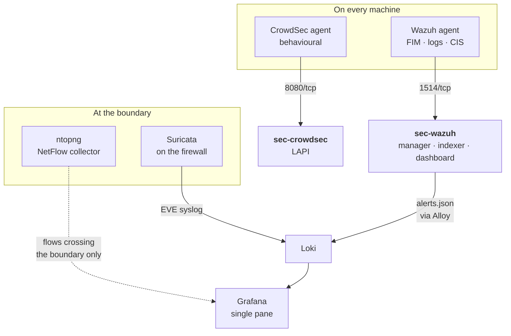

# Architecture

## Where the stack lives, and why it is not arbitrary

Most homelabs end up with asymmetric segments: a sandbox VLAN that can reach
the trusted LAN, and a trusted LAN that cannot reach back. That asymmetry
decides where the manager has to sit.

Wazuh and CrowdSec are **agent-initiated**. The agent opens a connection
outward to its manager, so the manager must be reachable *from* every
monitored host.

- Manager on the **sandbox segment**: every host on the trusted side is
  stranded, because the trusted side has no route inward.
- Manager on the **trusted segment**: sandbox agents reach it through the
  existing outbound path, and trusted hosts reach it locally. Works for the
  whole estate.

There is a second argument pointing the same way. The sandbox is where the
risky things run: model endpoints, unvetted containers, download clients. The
sandbox should not host the thing that watches it.

**So: the security stack belongs on the trusted segment.**

!!! warning "The dependency that is easy to miss"
    If you later add a firewall rule blocking sandbox to trusted, you will cut
    every sandbox agent off from its manager. The allow rules for the manager
    ports must go in **the same change** as the block, positioned **above** it
    in the rule order. See [Reference](../reference/index.md#firewall-rules).

## Do not multi-home these guests

Give every guest exactly one interface, on the trusted bridge. The sandbox
reaches them through the firewall, which is the entire point.

A multi-homed host is a hole in your segmentation whether or not you intended
it, and it is invisible in the firewall's own logs because the traffic never
reaches the firewall. If you find yourself wanting a second NIC on a security
guest, that is a signal the routing needs fixing, not the guest.

The same caution applies to container bridges. A container runtime that
attaches to two networks bridges them, regardless of the host's `FORWARD`
policy, because the runtime installs its own accept rules.

## Two sensors, because one is not enough

## Grafana stays the single pane

Security alerts are forwarded into Loki rather than left in a second dashboard.
Suricata's EVE output goes to Loki as `job="suricata"`; Wazuh's
`/var/ossec/logs/alerts/alerts.json` is tailed by the Alloy collector that
every monitored host already runs, as `job="wazuh"`.

The Wazuh dashboard stays, but for **deep investigation only**. The reason is
operational rather than aesthetic: an alert stream that lives somewhere you do
not habitually look is an alert stream you do not read. One pane for "something
is wrong", specialised tools for "what exactly happened".

This also keeps the planes separate without splitting the interface. A disk
filling up and a host being compromised both produce alerts, but they need
different data, different retention and different responses. Separate
datasources and separate rules, one place to look.

The network sensors are cheap and broad. They are also structurally blind to:

- two hosts talking on the same layer 2 segment,
- any multi-homed host,
- container-to-container traffic on a shared bridge.

The host agents cover exactly those cases. **An empty ntopng is not evidence
that no lateral traffic occurred.** Read the two together or you will draw a
confident wrong conclusion.

## Tool selection

Agents are deployed by `ansible/roles/wazuh_agent`, enabled solely by
membership of the `wazuh_agents` inventory group, matching how `autoupdate`
gates patching. Nothing is installed on a fleet host by hand.

| Need | Choice | Why this one |
|---|---|---|
| Network IDS | Suricata | Already bundled in OPNsense and pfSense. No new guest, GPLv2. |
| Blocking | CrowdSec | Behavioural rather than signature. MIT with no paywalled engine features, and its bouncers push decisions to a CDN edge so hostile traffic never reaches the origin. |
| HIDS, FIM, SIEM | Wazuh | GPLv2, genuinely no feature paywall. The only tool here that covers segmentation bypasses, because it is agent-based. |
| DNS | AdGuard Home | Single Go binary, GPLv3. Query logs are the cheapest detection data available. |
| SSO | Authelia | Apache-2.0 throughout and simpler than a full IdP for a handful of services. |
| Secrets | OpenBao | MPL-2.0 under the Linux Foundation. |
| Flows | ntopng Community | GPLv3. Verifies that segmentation actually holds after you change a rule. |
| Vuln scanning | Greenbone GVM | GPLv2. Detects drift: a new unauthenticated service, another multi-homed host. |

### On OpenBao rather than HashiCorp Vault

Vault moved from MPL-2.0 to BUSL 1.1 in August 2023 and is no longer
OSI-approved open source. OpenBao is the Linux Foundation fork of Vault 1.14.0,
the last MPL-2.0 release. It speaks the same API and carries the same secrets
engines and auth methods it inherited at the fork, and has since pulled several
former Vault Enterprise features into open source. Features added to Vault
after the fork are not automatically present.

### On the one component that is free but not open source

Edge authentication services such as Cloudflare Access are free at homelab
scale but are SaaS, not open source. They are also the only thing that can stop
an unauthenticated request *before* it reaches your origin, which no
self-hosted tool can do for a tunnel whose edge you do not control. If that
tradeoff is acceptable, use both: edge auth in front, Authelia behind it, so a
misconfigured edge policy is not a total loss.
