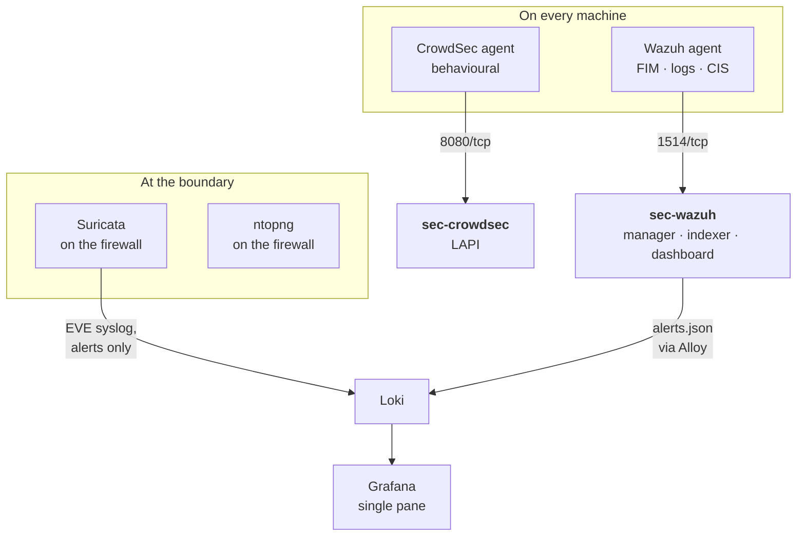

# Architecture

## Where the stack lives, and why it is not arbitrary

Most homelabs end up with asymmetric segments: a sandbox VLAN that can reach
the trusted LAN, and a trusted LAN that cannot reach back. That asymmetry
decides where the manager has to sit.

Wazuh and CrowdSec are **agent-initiated**. The agent opens a connection
outward to its manager, so the manager must be reachable *from* every
monitored host.

- Manager on the **sandbox segment**: every host on the trusted side is
  stranded, because the trusted side has no route inward.
- Manager on the **trusted segment**: sandbox agents reach it through the
  existing outbound path, and trusted hosts reach it locally. Works for the
  whole estate.

There is a second argument pointing the same way. The sandbox is where the
risky things run: model endpoints, unvetted containers, download clients. The
sandbox should not host the thing that watches it.

**So: the security stack belongs on the trusted segment.**

!!! warning "The dependency that is easy to miss"
    If you later add a firewall rule blocking sandbox to trusted, you will cut
    every sandbox agent off from its manager. The allow rules for the manager
    ports must go in **the same change** as the block, positioned **above** it
    in the rule order. See [Reference](../reference/index.md#firewall-rules).

## The scanner is the exception

Everything above assumes the tool is agent-initiated. A vulnerability scanner
is the inverse: it **originates** connections to its targets, so the question
is not "can the targets reach it?" but "can it reach the targets?". Put it on
the trusted segment and it has no route into the sandbox at all, which is where
most of the estate lives.

So `sec-scan` is the one guest on the **sandbox** bridge. From there it reaches
the sandbox directly and the trusted segment through the firewall's ordinary
outbound NAT, the same path every sandbox host already has.

That placement has costs, and they are the price of a scanner that can see
everything:

- **It lives beside the workloads you trust least**, which cuts against "the
  sandbox should not host the thing that watches it". A scanner does not watch
  continuously, so the cost is smaller than for a manager, but it is real:
  never give it privileged credentials for authenticated scans.
- **Trusted-side targets see the firewall's address**, not the scanner's,
  because of NAT.
- **Suricata sees its scans** of the trusted side and alerts on them.
- **A future sandbox-to-trusted block cuts it off** from the trusted side,
  unless it gets its own pass rule above the block. That rule is exactly the
  reach that makes a compromised scanner dangerous; decide it deliberately. See
  [Reference](../reference/index.md#firewall-rules).

The alternative was a pinhole the other way: a route and a firewall rule
letting a trusted-side scanner reach into the sandbox. It works, but it punches
a hole in the one direction the asymmetry exists to protect.

## Do not multi-home these guests

Give every guest exactly one interface. All but `sec-scan` sit on the trusted
bridge. The sandbox reaches them through the firewall, which is the entire
point.

A multi-homed host is a hole in your segmentation whether or not you intended
it, and it is invisible in the firewall's own logs because the traffic never
reaches the firewall. If you find yourself wanting a second NIC on a security
guest, that is a signal the routing needs fixing, not the guest.

The same caution applies to container bridges. A container runtime that
attaches to two networks bridges them, regardless of the host's `FORWARD`
policy, because the runtime installs its own accept rules.

## Two sensors, because one is not enough

## Grafana stays the single pane

Security alerts are forwarded into Loki rather than left in a second dashboard.
Suricata's EVE output goes to Loki as `job="suricata"`; Wazuh's
`/var/ossec/logs/alerts/alerts.json` is tailed by the Alloy collector that
every monitored host already runs, as `job="wazuh"`.

These are the two security streams covered by the manual setup instructions
in [Wiring](../wiring/index.md); they are not provisioned automatically. Each
other service keeps its own interface: ntopng on the firewall, Greenbone's reports, CrowdSec's
decisions and AdGuard's query log. OPNsense's syslog output also carries
Suricata's **alerts only**; its HTTP and TLS metadata stays in `eve.json` on the
firewall.

The Wazuh dashboard stays, but for **deep investigation only**. The reason is
operational rather than aesthetic: an alert stream that lives somewhere you do
not habitually look is an alert stream you do not read. One pane for "something
is wrong", specialised tools for "what exactly happened".

This also keeps the planes separate without splitting the interface. A disk
filling up and a host being compromised both produce alerts, but they need
different data, different retention and different responses. Separate
datasources and separate rules, one place to look.

The network sensors are cheap and broad. They are also structurally blind to:

- two hosts talking on the same layer 2 segment,
- any multi-homed host,
- container-to-container traffic on a shared bridge.

The host agents cover exactly those cases. **An empty ntopng is not evidence
that no lateral traffic occurred.** Read the two together or you will draw a
confident wrong conclusion.

## Tool selection

Agents are deployed by `ansible/roles/wazuh_agent`, enabled solely by
membership of the `wazuh_agents` inventory group, matching how `autoupdate`
gates patching. Nothing is installed on a fleet host by hand.

| Need | Choice | Why this one |
|---|---|---|
| Network IDS | Suricata | Already bundled in OPNsense and pfSense. No new guest, GPLv2. |
| Blocking | CrowdSec | Behavioural rather than signature. MIT with no paywalled engine features, and its bouncers push decisions to a CDN edge so hostile traffic never reaches the origin. |
| HIDS, FIM, SIEM | Wazuh | GPLv2, genuinely no feature paywall. The only tool here that covers segmentation bypasses, because it is agent-based. |
| DNS | AdGuard Home | Single Go binary, GPLv3. Query logs are the cheapest detection data available. |
| Flows | ntopng Community | GPLv3, on the firewall. Verifies that segmentation actually holds after you change a rule. |
| Vuln scanning | Greenbone GVM | GPLv2. Detects drift: a new unauthenticated service, another multi-homed host. |

### Suricata on the firewall

OPNsense bundles Suricata, so the network IDS runs on the firewall without a
separate guest. Its EVE JSON output supplies the `job="suricata"` stream in
Loki; see [Wiring](../wiring/index.md) for collector configuration.

### ntopng on the firewall

OPNsense's `os-ntopng` plugin captures directly on the firewall's interfaces.
Capture on LAN to retain host identity before NAT rewrites source addresses.

ntopng and Redis share firewall RAM and CPU with Suricata. Budget an additional
2 GB RAM and 2 vCPU, then measure. ntopng also adds a second deep packet parser
beside Suricata, increasing the firewall's attack surface. Keep its management
UI inaccessible from WAN.
