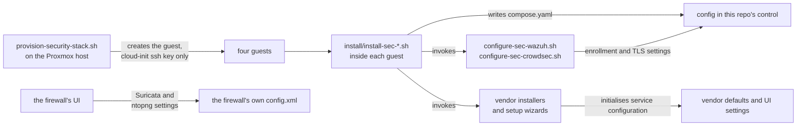

# What runs where

One page per guest: what the service actually does, which ports it owns, every
config file involved, and how to tell it is working.

Two kinds of configuration appear below, and the difference matters when
something drifts:

- **Written by this repo.** The `install/` scripts create these files, so the
  content here is exactly what lands on disk. Re-running an installer rewrites
  them.
- **Written by the vendor installer.** Created by upstream's own packaging or
  setup wizard. This repo does not manage them, so treat the paths as the place
  to look rather than as something `git` will restore.

## At a glance

| Guest | Runs | Does | Config owned by |
|---|---|---|---|
| [`sec-wazuh`](#sec-wazuh) | Wazuh manager, indexer, dashboard | Host intrusion detection, file integrity, log analysis | vendor + authenticated enrollment |
| [`sec-scan`](#sec-scan) | Greenbone Community containers | Vulnerability scanning, drift detection | this repo (compose) |
| [`sec-crowdsec`](#sec-crowdsec) | CrowdSec Local API | Behavioural detection, shared blocklist decisions | vendor + authenticated HTTPS LAPI |
| [`sec-dns`](#sec-dns) | AdGuard Home | Recursive resolver, filtering, query logs | vendor (UI) |
| *the firewall* | [Suricata](#suricata) | Network IDS at the boundary | your firewall |
| *the firewall* | [ntopng](#ntopng) | Live flow visibility across the boundary | your firewall |

Suricata and ntopng are not guests. Both run on the firewall itself: OPNsense
bundles Suricata and offers ntopng as a plugin, so there is nothing here to
provision. See [Wiring](../wiring/index.md).

## Logging in

No guest has a password. Every login is your SSH key, the one passed to the
provisioning script as `SSH_PUBKEY`.

| Guest | Kind | Log in as | Bridge |
|---|---|---|---|
| `sec-wazuh` (200) | VM | `admin`, with passwordless `sudo` | trusted |
| `sec-scan` (201) | VM | `admin`, with passwordless `sudo` | sandbox, so through your jump host |
| `sec-crowdsec` (210) | LXC | `root` | trusted |
| `sec-dns` (211) | LXC | `root` | trusted |

When SSH fails:

- **An LXC** has a way in that needs no credentials at all: `pct enter <vmid>`
  on the Proxmox host gives a root shell.
- **A VM does not.** There is no password, so the serial console cannot log you
  in, and `qm guest exec` only works once the installer has added the guest
  agent. Until then SSH is the only door. If you want a fallback, set one with
  `qm set <vmid> --cipassword` before you need it.

The services have their own logins, created at install time:

| Service | User | First password | Then |
|---|---|---|---|
| Wazuh dashboard | `admin` | Random, printed at the end of the install | Also saved, with every internal password and the TLS certificates, in `wazuh-install-files.tar`. [Move it off the guest](#sec-wazuh). |
| Greenbone | `admin` | **`admin`** | Change it before anything else. [How](#first-run) |
| ntopng | `admin` | **`admin`** | ntopng forces a change at first login |
| AdGuard Home | yours | Chosen in the setup wizard | Whoever reaches the wizard first sets it, so finish it straight after install |
| CrowdSec | none | No UI | Credentials are issued per agent and per bouncer, [below](#enrol-an-agent) |

Keep them in a password manager.

---

## sec-wazuh

**What it does.** The only tool here that sees inside a host. Agents report
file integrity changes, log events, running processes and CIS benchmark results
to the manager, which correlates them into alerts. Because it is agent-based it
covers the case a network sensor structurally cannot: two hosts talking on the
same layer 2 segment, and a multi-homed host routing around the firewall.

Three services in one guest, which is why it is the largest:

| Service | What it is | Listens on |
|---|---|---|
| `wazuh-manager` | Correlation engine, agent endpoint | 1514/tcp events, 1515/tcp enrolment, 55000/tcp API |
| `wazuh-indexer` | OpenSearch, stores alerts | 9200/tcp, localhost |
| `wazuh-dashboard` | Web UI | 443/tcp |

**Installed by** `install/install-sec-wazuh.sh`, which runs upstream's
`wazuh-install.sh -a -i` (all-in-one, ignore-check).

!!! danger "The admin password is not only in your scrollback"
    It is printed at the end of the install, and it is also written, with
    every internal password and the TLS certificates, to
    `wazuh-install-files.tar` in `WAZUH_WORKDIR` (default `/root/wazuh-install`):

    ```bash
    cd /root/wazuh-install
    tar -O -xvf wazuh-install-files.tar wazuh-install-files/wazuh-passwords.txt
    ```

    Put the admin password in your password manager, then move the tar off the
    guest. It holds every credential the stack uses.

### Enrollment configuration

`configure-sec-wazuh.sh` requires a prepared password and matching certificate/key,
sets password authentication on the enrollment service, and creates the requested
agent group (`homelab` by default). The Ansible role verifies that group before
installing agents and supplies both the password and trusted CA. See
[Bootstrap inputs](../security.md#bootstrap-inputs) for initial setup and migration.

### Configs (vendor)

| Path | What it controls |
|---|---|
| `/var/ossec/etc/ossec.conf` | Manager: which decoders and rules load, FIM directories, active response |
| `/var/ossec/etc/shared/default/agent.conf` | Pushed to every agent in the `default` group |
| `/etc/wazuh-indexer/opensearch.yml` | Indexer bind address, TLS, cluster name |
| `/etc/wazuh-dashboard/opensearch_dashboards.yml` | Dashboard bind address and indexer URL |

### Data and logs

| Path | Contents |
|---|---|
| `/var/ossec/logs/alerts/alerts.json` | Every alert, one JSON object per line. This is what Alloy tails |
| `/var/ossec/logs/alerts/YYYY/MMM/` | Daily gzipped alert archives, a few MB per day |
| `/var/ossec/logs/ossec.log` | Manager's own log |

!!! warning "Set index retention before you have data, not after"
    In **Dashboard → Index Management → State management policies**, create a
    policy that rolls over at 7 days and deletes at 30, applied to
    `wazuh-alerts-*`. Without it the indices grow until the disk fills, and
    ingestion then stops *silently* rather than alerting.

!!! danger "Do not enable `<logall>` or `<logall_json>`"
    Those archive the full event stream, not just alerts, and are genuinely
    large. The daily gzipped alert archives above are the cheap option: attach a
    second disk and bind-mount it to keep a year for a couple of GB.

### Verify

```bash
/var/ossec/bin/agent_control -l        # every host should read Active
```

Do not accept "the service is running" as evidence. Stop one agent, confirm it
goes `Disconnected`, then start it again.

---

## sec-scan

**What it does.** Originates connections to your hosts, port scans them,
fingerprints the services it finds and runs vulnerability tests against them.
Its value here is **drift detection**: a new unauthenticated service, another
multi-homed host, an interface nobody declared.

!!! danger "This is the one guest that must reach *in*"
    Wazuh and CrowdSec agents dial *out* to their managers, which is why the
    managers can live on the trusted segment and still see everything. A
    scanner is the inverse. It can only scan a segment it has a route to, and
    an unreachable segment produces an **empty report, not an error**, which
    reads exactly like a clean estate. Check `ip route` and a quick
    `nmap -sn <segment>` before you believe a clean result.

**It is the one guest on the sandbox bridge**, for exactly that reason. From
the trusted side it has no route into the sandbox at all. From the sandbox it
reaches the sandbox directly, and the trusted side through the firewall's
outbound NAT. [Architecture](../architecture/index.md#the-scanner-is-the-exception)
has the reasoning and the costs; the ones you will notice:

- Trusted-side targets log **the firewall's address** as the scanner, not
  `sec-scan`'s. That is NAT, not a bug.
- **Suricata sees every scan of the trusted side** and will alert on it. Either
  accept the alerts, or add a pass rule for `sec-scan`'s address and accept that
  it also blinds Suricata to this guest.
- If you add a sandbox-to-trusted block rule, `sec-scan` needs **its own pass
  rule above it**, or it can only scan the sandbox.

!!! bug "`apt-get install gvm` does not work on Debian stable"
    Debian dropped the GVM/OpenVAS stack. `gvm` is in **sid only**, and is
    absent from bookworm, trixie and forky, so the apt path fails with
    "Unable to locate package gvm". Greenbone's own documentation now leads
    with the Community Containers, which is what `install-sec-scan.sh` uses.

**Installed by** `install/install-sec-scan.sh`, which fetches Greenbone's
published compose file to `/opt/greenbone/compose.yaml` and brings it up. That
is 21 services, including `gvmd` (the manager), `ospd-openvas` and `openvas`
(the scanners), `pg-gvm` (PostgreSQL), `redis-server`, `gsa` and `gsad` (the
web UI) and an `nginx` front end.

### Configs (this repo)

| Path | What it controls |
|---|---|
| `/opt/greenbone/compose.yaml` | Every service, image tag, volume and published port |

Ports come from that file and are bound to loopback deliberately:

```yaml
  nginx:
    ports:
      - 127.0.0.1:443:443
      - 127.0.0.1:9392:9392
```

Reach it over an SSH tunnel rather than republishing it. The guest is behind
the firewall, so the tunnel goes through your jump host:

```bash
ssh -J <jump-host> -N -L 9392:127.0.0.1:9392 admin@<sec-scan>
```

Keep the UI bound to loopback and use the SSH tunnel for access.

### Data

Seventeen named Docker volumes. The ones that grow:

| Volume | Mounted at | Contents |
|---|---|---|
| `psql_data_vol` | `/var/lib/postgresql` | Scan results, SCAP and CVE data |
| `vt_data_vol` | `/var/lib/openvas/plugins` | Vulnerability tests (NVTs) |
| `gvmd_data_vol` | `/var/lib/gvm` | Manager state, report formats |
| `notus_data_vol` | `/var/lib/notus` | Product vulnerability data |

### First run

```bash
cd /opt/greenbone
docker compose pull                 # includes the feed data images
docker compose up -d                # refreshes data volumes
docker compose ps                   # data services should be healthy
docker compose exec -u gvmd gvmd gvmd --user=admin --new-password='<pick one>'
```

The feed sync takes **several hours** and must not be interrupted.

The containers create `admin` with the password **`admin`**. The second command
changes it; run it before anything else, not after the feed finishes.

For authenticated scans, give Greenbone an **unprivileged** account on each
target. Reading the installed package list needs no root, and this guest lives
beside the workloads you trust least.

---

## sec-crowdsec

**What it does.** Behavioural rather than signature based: it parses logs,
recognises patterns like credential stuffing or aggressive crawling, and emits
**decisions** (ban this IP, for this long). Agents on other hosts ship their
parsed events here, and *bouncers* enforce the decisions wherever traffic
actually arrives.

This guest runs the **Local API (LAPI)** only. The agents live on the monitored
hosts; the bouncer belongs on whatever terminates your public tunnel, so
hostile traffic is dropped at the edge rather than at the origin.

**Installed by** `install/install-sec-crowdsec.sh`.

### Configs managed by this repo

`configure-sec-crowdsec.sh` updates the YAML structurally, preserves unrelated
settings, and tests the result before starting CrowdSec. It configures:

```yaml
api:
  server:
    listen_uri: 0.0.0.0:8080
    tls:
      cert_file: /etc/crowdsec/tls/server.crt
      key_file: /etc/crowdsec/tls/server.key
```

The local API credentials retain their login/password but switch to HTTPS and
the trusted CA. Supply the certificate, private key, CA and a DNS name matching
the certificate as described in [Security](../security.md#bootstrap-inputs).
The configure command can harden an existing installation without reinstalling
packages. It stops the service before writing configuration and leaves it
stopped if validation fails.

### Configs (vendor)

| Path | What it controls |
|---|---|
| `/etc/crowdsec/acquis.yaml` | Which log files and journald units are parsed |
| `/etc/crowdsec/profiles.yaml` | What a detection turns into: ban duration, notifications |
| `/etc/crowdsec/local_api_credentials.yaml` | On each **agent**, points it at this LAPI |
| `/var/lib/crowdsec/data/crowdsec.db` | SQLite: decisions, alerts, machines |

### Enrol an agent

```bash
cscli machines add <agent-hostname> --auto      # on sec-crowdsec, prints credentials
```

```yaml
# /etc/crowdsec/local_api_credentials.yaml, on the agent
url: https://<sec-crowdsec-certificate-dns-name>:8080
ca_cert_path: /etc/crowdsec/tls/ca.crt
login: <from above>
password: <from above>
```

### Verify

```bash
cscli machines list       # every agent present
cscli metrics             # parsers must show non-zero lines read
cscli decisions list
```

`cscli metrics` is the one that matters. A LAPI with agents attached but zero
lines parsed is running and useless.

---

## sec-dns

**What it does.** A recursive resolver you control, which is worth having for
the filtering but worth *more* for the query log. DNS logs are the cheapest
detection data available: they show a compromised host reaching for a command
and control domain before any payload moves.

**Installed by** `install/install-sec-dns.sh`, which runs AdGuard's official
installer into `/opt/AdGuardHome/`.

| Port | Purpose |
|---|---|
| 53/tcp, 53/udp | DNS |
| 3000/tcp | Setup wizard and admin UI |

### Configs (vendor, via the UI)

| Path | What it controls |
|---|---|
| `/opt/AdGuardHome/AdGuardHome.yaml` | Everything: upstreams, filters, clients, retention |
| `/opt/AdGuardHome/data/querylog.json` | The query log itself |
| `/opt/AdGuardHome/data/stats.db` | Aggregated statistics |

The installer deliberately writes no config. Two settings to change in the UI
before you rely on it:

- **Settings → General → Query log retention: 30 days**, so it expires
  alongside the Wazuh indices.
- **Settings → DNS → Upstream**, pointed at your firewall's resolver or at DoH
  directly.

!!! warning "Order matters, and getting it wrong takes the LAN offline"
    Verify from a *test client*, not from the server, before you change
    anything on the router:

    ```bash
    dig +short example.com @<sec-dns>
    ```

    Only then point DHCP at it, and keep a public resolver as **secondary** for
    the first week so a failure degrades instead of going dark.

!!! info "Client attribution depends on where this guest sits"
    If a segment reaches this resolver through a NATing firewall rather than
    directly, every device on that segment arrives as one source address, and
    per-client rules and statistics stop being possible for it. See
    [Architecture](../architecture/index.md).

---

## Suricata

**What it does.** Signature-based network intrusion detection at the boundary,
inspecting traffic as it crosses the firewall.

**There is nothing to provision.** OPNsense and pfSense both bundle it; enable
it on the WAN interface in the firewall UI. It writes EVE JSON to
`/var/log/suricata/eve.json`, which reaches Grafana as `job="suricata"`.

See [Wiring](../wiring/index.md#2-suricata-eve-into-loki).

---

## ntopng

**What it does.** Answers "did that firewall rule actually do what I think?"
It shows which hosts talk to which, over what, and how much, live. It is the
fastest way to verify segmentation still holds after a change.

**It runs on the firewall**, from OPNsense's `os-ntopng` plugin, and captures
packets on the firewall's own interfaces. It builds flow summaries and
identifies applications from the captured traffic.

**Installed from** the OPNsense UI, not this repo:

1. **System → Firmware → Plugins**: install `os-redis`, then enable it under
   **Services → Redis**. ntopng needs Redis running, and the plugin warns you if
   it is missing.
2. Install `os-ntopng`, then **Services → Ntopng**: enable it, pick the
   interfaces, and either leave HTTP on port 3000 or set an HTTPS port with a
   certificate.

!!! tip "Capture on LAN, not WAN"
    On the WAN interface every sandbox host appears as the firewall's own
    address, because NAT has already rewritten it. The LAN interface sees the
    real addresses, which is the whole point.

### Configs (generated by the plugin)

| Path | What it controls |
|---|---|
| `/usr/local/etc/ntopng.conf` | Generated from the UI: `-i` per interface, `-w` port, `-n` DNS mode |
| `/etc/rc.conf.d/ntopng` | Whether the service starts |
| `/var/db/ntopng/` | Timeseries and runtime data |

Change settings in the UI, not in the file. OPNsense regenerates the file from
its own configuration, which also means the firewall's configuration backup
carries these settings.

The UI listens on **every firewall interface**, not only LAN. The WAN is closed
by default; keep it that way. First login is `admin` / `admin`, and ntopng
forces a change.

### Verify

Generate traffic from one sandbox host, then find that host under **Hosts** in
the ntopng UI with a recent last-seen time. On the firewall's shell:

```bash
/usr/local/etc/rc.d/ntopng status
```

!!! warning "An empty ntopng is not evidence of no lateral traffic"
    This sees only what **crosses the firewall**. Two hosts on the same segment,
    or a multi-homed host, never appear here at all. That gap is exactly what
    the Wazuh agents cover.

ntopng answers *who and what*, live. *How much*, per guest over a day or a
week, including guest-to-guest traffic on one bridge, is on Grafana's
[Guest Traffic](https://harshitruwali.github.io/homelab-infra/monitoring/monitoring/dashboards/#guest-traffic)
dashboard, read from the hypervisor rather than the firewall.

!!! note "Budget firewall resources for it"
    ntopng and Redis share the firewall with Suricata. As a starting point,
    give the firewall VM an additional 2 GB of RAM and 2 vCPU, then measure. It is also a second deep packet parser on the
    firewall beside Suricata, which is more attack surface on the one box that
    must not fall.

---

## Where the configs come from



Anything in the right-hand boxes survives only where it was written: a guest's
own disk, or the firewall's configuration. That is what
[Operations](../operations/index.md#backups) covers.
