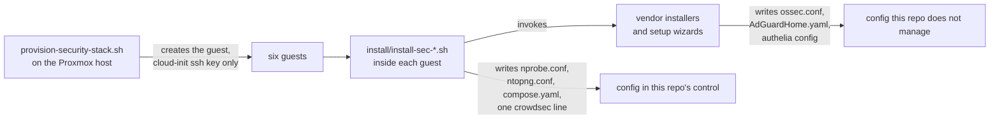

# What runs where

One page per guest: what the service actually does, which ports it owns, every
config file involved, and how to tell it is working.

Two kinds of configuration appear below, and the difference matters when
something drifts:

- **Written by this repo.** The `install/` scripts create these files, so the
  content here is exactly what lands on disk. Re-running an installer rewrites
  them.
- **Written by the vendor installer.** Created by upstream's own packaging or
  setup wizard. This repo does not manage them, so treat the paths as the place
  to look rather than as something `git` will restore.

## At a glance

| Guest | Runs | Does | Config owned by |
|---|---|---|---|
| [`sec-wazuh`](#sec-wazuh) | Wazuh manager, indexer, dashboard | Host intrusion detection, file integrity, log analysis | vendor |
| [`sec-scan`](#sec-scan) | Greenbone Community containers | Vulnerability scanning, drift detection | this repo (compose) |
| [`sec-crowdsec`](#sec-crowdsec) | CrowdSec Local API | Behavioural detection, shared blocklist decisions | this repo (one edit) |
| [`sec-dns`](#sec-dns) | AdGuard Home | Recursive resolver, filtering, query logs | vendor (UI) |
| [`sec-auth`](#sec-auth) | Authelia, OpenBao | SSO in front of UIs, secrets underneath services | vendor |
| [`sec-ntopng`](#sec-ntopng) | ntopng, nprobe | NetFlow collection, flow visibility | this repo |
| *the firewall* | [Suricata](#suricata) | Network IDS at the boundary | your firewall |

Suricata is not a guest. It runs on OPNsense or pfSense, which already bundles
it, so there is nothing here to provision. See [Wiring](../wiring/index.md).

---

## sec-wazuh

**What it does.** The only tool here that sees inside a host. Agents report
file integrity changes, log events, running processes and CIS benchmark results
to the manager, which correlates them into alerts. Because it is agent-based it
covers the case a network sensor structurally cannot: two hosts talking on the
same layer 2 segment, and a multi-homed host routing around the firewall.

Three services in one guest, which is why it is the largest:

| Service | What it is | Listens on |
|---|---|---|
| `wazuh-manager` | Correlation engine, agent endpoint | 1514/tcp events, 1515/tcp enrolment, 55000/tcp API |
| `wazuh-indexer` | OpenSearch, stores alerts | 9200/tcp, localhost |
| `wazuh-dashboard` | Web UI | 443/tcp |

**Installed by** `install/install-sec-wazuh.sh`, which runs upstream's
`wazuh-install.sh -a -i` (all-in-one, ignore-check).

### Configs (vendor)

| Path | What it controls |
|---|---|
| `/var/ossec/etc/ossec.conf` | Manager: which decoders and rules load, FIM directories, active response |
| `/var/ossec/etc/shared/default/agent.conf` | Pushed to every agent in the `default` group |
| `/etc/wazuh-indexer/opensearch.yml` | Indexer bind address, TLS, cluster name |
| `/etc/wazuh-dashboard/opensearch_dashboards.yml` | Dashboard bind address and indexer URL |

### Data and logs

| Path | Contents |
|---|---|
| `/var/ossec/logs/alerts/alerts.json` | Every alert, one JSON object per line. This is what Alloy tails |
| `/var/ossec/logs/alerts/YYYY/MMM/` | Daily gzipped alert archives, a few MB per day |
| `/var/ossec/logs/ossec.log` | Manager's own log |

!!! warning "Set index retention before you have data, not after"
    In **Dashboard → Index Management → State management policies**, create a
    policy that rolls over at 7 days and deletes at 30, applied to
    `wazuh-alerts-*`. Without it the indices grow until the disk fills, and
    ingestion then stops *silently* rather than alerting.

!!! danger "Do not enable `<logall>` or `<logall_json>`"
    Those archive the full event stream, not just alerts, and are genuinely
    large. The daily gzipped alert archives above are the cheap option: attach a
    second disk and bind-mount it to keep a year for a couple of GB.

### Verify

```bash
/var/ossec/bin/agent_control -l        # every host should read Active
```

Do not accept "the service is running" as evidence. Stop one agent, confirm it
goes `Disconnected`, then start it again.

---

## sec-scan

**What it does.** Originates connections to your hosts, port scans them,
fingerprints the services it finds and runs vulnerability tests against them.
Its value here is **drift detection**: a new unauthenticated service, another
multi-homed host, an interface nobody declared.

!!! danger "This is the one guest that must reach *in*"
    Wazuh and CrowdSec agents dial *out* to their managers, which is why the
    managers can live on the trusted segment and still see everything. A
    scanner is the inverse. It can only scan a segment it has a route to, and
    an unreachable segment produces an **empty report, not an error**, which
    reads exactly like a clean estate. Check `ip route` and a quick
    `nmap -sn <segment>` before you believe a clean result.

!!! bug "`apt-get install gvm` does not work on Debian stable"
    Debian dropped the GVM/OpenVAS stack. `gvm` is in **sid only**, and is
    absent from bookworm, trixie and forky, so the apt path fails with
    "Unable to locate package gvm". Greenbone's own documentation now leads
    with the Community Containers, which is what `install-sec-scan.sh` uses.

**Installed by** `install/install-sec-scan.sh`, which fetches Greenbone's
published compose file to `/opt/greenbone/compose.yaml` and brings it up. That
is 21 services, including `gvmd` (the manager), `ospd-openvas` and `openvas`
(the scanners), `pg-gvm` (PostgreSQL), `redis-server`, `gsa` and `gsad` (the
web UI) and an `nginx` front end.

### Configs (this repo)

| Path | What it controls |
|---|---|
| `/opt/greenbone/compose.yaml` | Every service, image tag, volume and published port |

Ports come from that file and are bound to loopback deliberately:

```yaml
  nginx:
    ports:
      - 127.0.0.1:443:443
      - 127.0.0.1:9392:9392
```

Reach it over an SSH tunnel rather than republishing it:

```bash
ssh -N -L 9392:127.0.0.1:9392 admin@<sec-scan>
```

To serve it on the LAN instead, set `NGINX_HOST` on the `gvm-config` service
and put [Authelia](#sec-auth) in front.

### Data

Seventeen named Docker volumes. The ones that grow:

| Volume | Mounted at | Contents |
|---|---|---|
| `psql_data_vol` | `/var/lib/postgresql` | Scan results, SCAP and CVE data |
| `vt_data_vol` | `/var/lib/openvas/plugins` | Vulnerability tests (NVTs) |
| `gvmd_data_vol` | `/var/lib/gvm` | Manager state, report formats |
| `notus_data_vol` | `/var/lib/notus` | Product vulnerability data |

### First run

```bash
cd /opt/greenbone
docker compose run --rm greenbone-feed-sync greenbone-feed-sync --type all
docker compose exec -u gvmd gvmd gvmd --user=admin --new-password='<pick one>'
```

The feed sync takes **several hours** and must not be interrupted. There is no
default login; the second command creates one.

---

## sec-crowdsec

**What it does.** Behavioural rather than signature based: it parses logs,
recognises patterns like credential stuffing or aggressive crawling, and emits
**decisions** (ban this IP, for this long). Agents on other hosts ship their
parsed events here, and *bouncers* enforce the decisions wherever traffic
actually arrives.

This guest runs the **Local API (LAPI)** only. The agents live on the monitored
hosts; the bouncer belongs on whatever terminates your public tunnel, so
hostile traffic is dropped at the edge rather than at the origin.

**Installed by** `install/install-sec-crowdsec.sh`.

### Configs (this repo edits one line)

`/etc/crowdsec/config.yaml`, so that agents on other hosts can reach the LAPI
rather than only localhost:

```yaml
api:
  server:
    listen_uri: 0.0.0.0:8080      # default is 127.0.0.1:8080
```

!!! bug "That edit used to fail silently"
    `listen_uri` is nested **four** spaces deep under `api:` → `server:`. The
    installer's original `sed` anchored on a two-space indent, so it matched
    nothing, reported success, and left the LAPI on localhost. Every agent
    enrolment then failed later, a long way from the cause. The installer now
    matches any indentation **and asserts the result**, so a future upstream
    change fails loudly instead.

### Configs (vendor)

| Path | What it controls |
|---|---|
| `/etc/crowdsec/acquis.yaml` | Which log files and journald units are parsed |
| `/etc/crowdsec/profiles.yaml` | What a detection turns into: ban duration, notifications |
| `/etc/crowdsec/local_api_credentials.yaml` | On each **agent**, points it at this LAPI |
| `/var/lib/crowdsec/data/crowdsec.db` | SQLite: decisions, alerts, machines |

### Enrol an agent

```bash
cscli machines add <agent-hostname> --auto      # on sec-crowdsec, prints credentials
```

```yaml
# /etc/crowdsec/local_api_credentials.yaml, on the agent
url: http://<sec-crowdsec>:8080
login: <from above>
password: <from above>
```

### Verify

```bash
cscli machines list       # every agent present
cscli metrics             # parsers must show non-zero lines read
cscli decisions list
```

`cscli metrics` is the one that matters. A LAPI with agents attached but zero
lines parsed is running and useless.

---

## sec-dns

**What it does.** A recursive resolver you control, which is worth having for
the filtering but worth *more* for the query log. DNS logs are the cheapest
detection data available: they show a compromised host reaching for a command
and control domain before any payload moves.

**Installed by** `install/install-sec-dns.sh`, which runs AdGuard's official
installer into `/opt/AdGuardHome/`.

| Port | Purpose |
|---|---|
| 53/tcp, 53/udp | DNS |
| 3000/tcp | Setup wizard and admin UI |

### Configs (vendor, via the UI)

| Path | What it controls |
|---|---|
| `/opt/AdGuardHome/AdGuardHome.yaml` | Everything: upstreams, filters, clients, retention |
| `/opt/AdGuardHome/data/querylog.json` | The query log itself |
| `/opt/AdGuardHome/data/stats.db` | Aggregated statistics |

The installer deliberately writes no config. Two settings to change in the UI
before you rely on it:

- **Settings → General → Query log retention: 30 days**, so it expires
  alongside the Wazuh indices.
- **Settings → DNS → Upstream**, pointed at your firewall's resolver or at DoH
  directly.

!!! warning "Order matters, and getting it wrong takes the LAN offline"
    Verify from a *test client*, not from the server, before you change
    anything on the router:

    ```bash
    dig +short example.com @<sec-dns>
    ```

    Only then point DHCP at it, and keep a public resolver as **secondary** for
    the first week so a failure degrades instead of going dark.

!!! info "Client attribution depends on where this guest sits"
    If a segment reaches this resolver through a NATing firewall rather than
    directly, every device on that segment arrives as one source address, and
    per-client rules and statistics stop being possible for it. See
    [Architecture](../architecture/index.md).

---

## sec-auth

Two unrelated services that share a guest because both are small and both are
about credentials.

**Installed by** `install/install-sec-auth.sh`. Neither is configured by it;
both need a config file written before they do anything.

### Authelia

**What it does.** Sits in front of internal web UIs and demands a login before
the request reaches them. That is what lets the management planes here stay
unpublished without becoming unusable.

| Path | What it controls |
|---|---|
| `/etc/authelia/configuration.yml` | Everything: session, storage, access control rules |
| `/etc/authelia/users_database.yml` | Users and password hashes, for the file backend |

Put it in front of Grafana, the Wazuh dashboard, ntopng and Greenbone.

### OpenBao

**What it does.** Holds the credentials every other service needs, so they stop
living in `.env` files. MPL-2.0, the Linux Foundation fork of Vault 1.14.0.
See [Architecture](../architecture/index.md#on-openbao-rather-than-hashicorp-vault)
for why not Vault.

```bash
bao operator init          # record the unseal keys somewhere physical
bao operator unseal        # three times
```

!!! danger "Keep the unseal keys and root token off this machine"
    Auto-unseal that stores the keys beside the vault defeats the vault. Print
    them, or put them in a password manager.

---

## sec-ntopng

**What it does.** Answers "did that firewall rule actually do what I think?"
It shows which hosts talk to which, over what, and how much. It is the fastest
way to verify segmentation still holds after a change.

**It collects NetFlow rather than sniffing packets**, and that is the whole
reason it can stay an unprivileged container. Sniffing needs `NET_ADMIN` and
`NET_RAW`, which would push it to a VM for no benefit. Your firewall exports
the flows; ntopng just receives them.

| Process | Role | Listens on |
|---|---|---|
| `nprobe` | NetFlow collector, feeds ntopng over ZMQ | 2055/udp |
| `ntopng` | Web UI and analysis | 3000/tcp |

**Installed by** `install/install-sec-ntopng.sh`, from ntop's own apt repo.

!!! bug "The repo URL is indexed by codename, not version"
    `packages.ntop.org/apt-stable/trixie/` exists; `.../13/` is a 404. The
    installer originally built the URL from `lsb_release -rs`, which returns
    `13` on Debian 13, so the download failed and `dpkg` then choked on the
    error page. It now uses `lsb_release -cs`. ntop indexes its *Ubuntu* repo by
    version number, which is where the confusion comes from.

### Configs (this repo)

`/etc/nprobe/nprobe.conf`:

```ini
--collector-port=2055
--zmq=tcp://127.0.0.1:5556
--interface=none
```

`--interface=none` is the line that makes this a collector. It tells nprobe not
to open a capture interface at all.

`/etc/ntopng/ntopng.conf`:

```ini
-i=tcp://127.0.0.1:5556
-w=3000
--community
```

`-i` is an ZMQ endpoint rather than a network interface, which is the same
decision from the other side.

### Export flows to it

On OPNsense, install the **softflowd** plugin, set the target to
`<sec-ntopng>:2055` and pick the interfaces you want flows from.

### Verify

```bash
tcpdump -ni any port 2055 -c 5      # on sec-ntopng
```

Confirm packets arrive before believing an empty UI.

!!! warning "An empty ntopng is not evidence of no lateral traffic"
    This sees only what **crosses the firewall**. Two hosts on the same segment,
    or a multi-homed host, never appear here at all. That gap is exactly what
    the Wazuh agents cover.

!!! info "nprobe is not GPL like ntopng"
    ntopng Community is GPLv3. `nprobe` is a separate ntop product under its own
    licence. Confirm the terms apply to your use before depending on this path.
    See [Licences](../reference/index.md#licences).

---

## Suricata

**What it does.** Signature-based network intrusion detection at the boundary,
inspecting traffic as it crosses the firewall.

**There is nothing to provision.** OPNsense and pfSense both bundle it; enable
it on the WAN interface in the firewall UI. It writes EVE JSON to
`/var/log/suricata/eve.json`, which reaches Grafana as `job="suricata"`.

See [Wiring](../wiring/index.md#2-suricata-eve-into-loki).

---

## Where the configs come from



Anything in the right-hand box survives only on the guest's own disk. That is
what [Operations](../operations/index.md#backups) covers.
